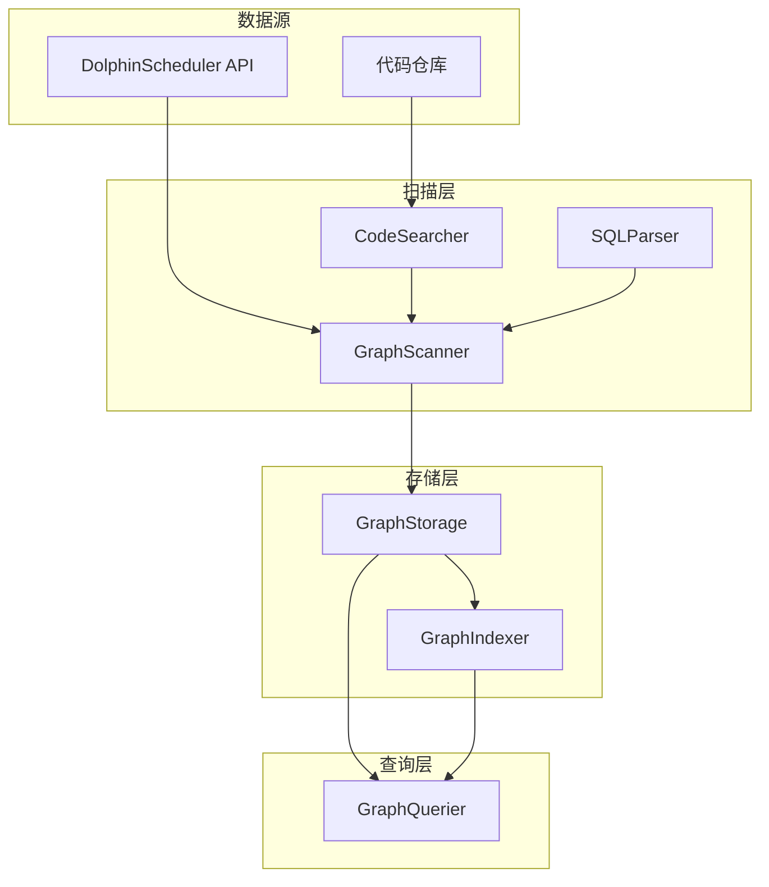
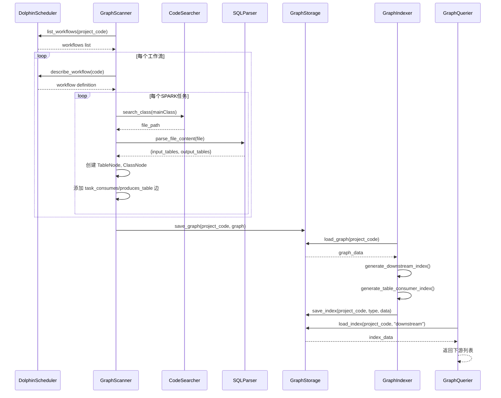

# DolphinScheduler 工作流知识图谱生成逻辑

## 概述

知识图谱系统通过扫描 DolphinScheduler 工作流定义和代码仓库，构建完整的数据血缘和依赖关系图，为错误分析和下游影响评估提供快速查询能力。

## 核心组件



## 数据模型

### 节点类型 (GraphNodes)

| 类型 | 说明 | 关键字段 |
|------|------|----------|
| WorkflowNode | 工作流 | code, name, schedule_type, schedule_cron, is_sub_workflow, parent_workflow |
| TaskNode | 任务 | code, name, workflow_code, task_type, spark_main_class, params |
| TableNode | 数据表 | full_name, table_type (HIVE/MYSQL/HDFS) |
| ClassNode | Java/Scala 类 | name, file_path, cross_project, source_project, tables_input, tables_output |

### 边类型 (GraphEdges)

| 类型 | 说明 | source → target |
|------|------|-----------------|
| workflow_depends_workflow | 工作流依赖 | workflow_code → workflow_code |
| workflow_calls_subworkflow | 子工作流调用 | parent_workflow → child_workflow |
| workflow_contains_task | 任务归属 | workflow_code → task_code |
| task_depends_task | 任务依赖 | pre_task_code → post_task_code |
| task_produces_table | 表产出 | task_code → table_name |
| task_consumes_table | 表消费 | task_code → table_name |
| class_maps_to_task | 类映射 | class_name → task_code |

## 扫描流程

### 1. GraphScanner.scan_project()

```
scan_project(project_code, project_name, ds_api_url, ds_api_token)
    ├── 创建 DSCLIClient（通过 dsctl CLI）
    ├── 初始化 Graph 对象
    ├── 获取所有工作流列表 (_fetch_workflows)
    │   └── dsctl workflow list --project-code {code}
    └── 遍历工作流 (_parse_workflow)
        ├── 获取工作流详情 (dsctl workflow describe)
        ├── 创建 WorkflowNode
        ├── 解析任务列表 (_parse_task)
        │   ├── 创建 TaskNode
        │   ├── SPARK 任务: 提取 mainClass → 搜索代码文件 → 解析表血缘
        │   ├── SUB_PROCESS: 提取子工作流关系
        │   └── DATAX: 解析 Hive→Doris 同步表血缘
        ├── 解析任务依赖关系 (_parse_task_dependencies)
        └── 解析工作流依赖 (_parse_workflow_dependencies)
    └── 保存图谱到 JSON
```

### 2. 工作流解析 (_parse_workflow)

从 DolphinScheduler API 获取工作流定义:

```json
{
  "workflow": {
    "code": "123456",
    "name": "data_processing",
    "schedule": {"crontab": "0 2 * * *"}
  },
  "tasks": [...],
  "relations": [{"preTaskCode": 111, "postTaskCode": 222}]
}
```

生成:
- WorkflowNode (调度类型、CRON 表达式)
- workflow_contains_task 边
- task_depends_task 边

### 3. 任务解析 (_parse_task)

针对不同任务类型:

| 任务类型 | 处理逻辑 |
|----------|----------|
| SPARK | 提取 mainClass → CodeSearcher 搜索源文件 → SQLParser 解析表血缘 |
| SUB_PROCESS | 提取 processDefinitionCode → workflow_calls_subworkflow 边 |
| DATAX | 解析 json 配置 → 提取 reader/writer 表 → task_consumes/produces_table 边 |
| DEPENDENT | 提取 dependence 配置 → workflow_depends_workflow 边 |
| 其他 | 仅创建 TaskNode |

### 4. 代码文件搜索 (CodeSearcher)

```python
search_class(class_name, project_name)
    ├── 根据 project_name 定位代码目录
    ├── 搜索 .java/.scala 文件
    ├── 匹配 class/object 定义
    └── 返回 {found, file_path, cross_project, source_project}
```

跨项目类标记:
- `cross_project=True`: 类不在当前项目目录
- `source_project`: 推测来源项目名

### 5. SQL 解析 (SQLParser)

解析 Spark 代码中的表操作:

```scala
// 输入表
spark.table("hive_db.source_table")
spark.sql("SELECT * FROM raw_data")

// 输出表
df.write.insertInto("target_table")
df.write.saveAsTable("output_db.result")
```

提取结果:
```json
{
  "input": ["hive_db.source_table", "raw_data"],
  "output": ["target_table", "output_db.result"]
}
```

支持的文件类型:
- .java (Java 源码)
- .scala (Scala/Spark 源码)
- .sql (纯 SQL 文件)

## 索引生成

### GraphIndexer.generate_all_indexes()

为加速查询，预计算三种索引:

#### 1. 下游依赖索引 (downstream)

使用 BFS 计算传递闭包:

```json
{
  "workflow_downstream": {
    "wf_001": {
      "direct": ["wf_002", "wf_003"],
      "all": ["wf_002", "wf_003", "wf_004", "wf_005"],
      "count": 4
    }
  },
  "task_downstream": {...}
}
```

用途: 查询失败任务的下游影响范围

#### 2. 表消费索引 (table_consumer)

```json
{
  "table_consumers": {
    "db.ods_table": {
      "workflows": ["wf_001", "wf_005"],
      "tasks": ["task_111", "task_555"],
      "classes": ["com.example.DataLoader"]
    }
  },
  "table_producers": {...}
}
```

用途: 查询表的生产者和消费者，评估数据变更影响

#### 3. 工作流节点索引 (workflow_nodes)

```json
{
  "workflow_tasks": {
    "wf_001": {
      "tasks": ["task_111", "task_112"],
      "task_names": {"task_111": "数据加载"},
      "task_types": {"task_111": "SPARK"},
      "spark_classes": {"task_111": "com.example.DataProcessor"}
    }
  }
}
```

用途: 快速获取工作流包含的任务信息

## 查询能力

### GraphQuerier 核心方法

| 方法 | 用途 | 返回内容 |
|------|------|----------|
| query_workflow_downstream | 工作流下游 | 直接/全部下游工作流列表 |
| query_workflow_upstream | 工作流上游 | 依赖此工作流的上游列表 |
| query_table_consumers | 表消费者 | 消费此表的工作流/任务/类 |
| query_table_producers | 表生产者 | 生产此表的工作流/任务/类 |
| query_workflow_nodes | 工作流任务 | 任务列表及类型、Spark 类名 |
| query_subworkflow_impact | 子工作流影响 | 子工作流失败对父工作流的影响 |
| query_cross_project_table_lineage | 跨项目血缘 | 多项目间表的生产/消费关系 |

### 子工作流影响分析

当子工作流中任务失败时，分析三个维度:

```
query_subworkflow_impact(project_code, sub_workflow_code, failed_task_code)
    ├── 子工作流内: failed_task_code 的下游任务
    ├── 父工作流内: 子工作流之后的下游任务
    ├── 父工作流下游: 父工作流的下游工作流列表
    └── 返回: {total_impact_count, impact_summary}
```

示例输出:
```
子工作流内 3 个下游任务受影响
父工作流内 2 个下游任务受影响
5 个下游工作流可能受影响
```

## 文件存储

### GraphStorage

```
data/graph/
├── {project_code}_graph.json          # 主图谱
├── {project_code}_index_downstream.json    # 下游索引
├── {project_code}_index_table_consumer.json # 表消费索引
├── {project_code}_index_workflow_nodes.json # 工作流节点索引
```

安全措施:
- 文件名清理: `re.sub(r'[^\w]', '_', code)`
- 路径穿越检查: 确保路径在 data_dir 内部

## 使用示例

### 扫描项目

```python
from src.graph import GraphScanner, GraphStorage

storage = GraphStorage("data/graph")
scanner = GraphScanner(storage, "/path/to/code_repo")

result = scanner.scan_project(
    project_code="123",
    project_name="data_pipeline",
    ds_api_url="http://ds-api:12345",
    ds_api_token="xxx"
)

print(f"扫描完成: {result['workflows_count']} 工作流, {result['tasks_count']} 任务")
```

### 生成索引

```python
from src.graph import GraphIndexer

indexer = GraphIndexer(storage)
indexes = indexer.generate_all_indexes("123")
```

### 查询下游影响

```python
from src.graph import GraphQuerier

querier = GraphQuerier(storage)

# 工作流下游
downstream = querier.query_workflow_downstream("123", "wf_001")
print(f"下游工作流: {downstream['all']}")

# 表消费者
consumers = querier.query_table_consumers("123", "db.ods_table")
print(f"消费此表的任务: {consumers['tasks']}")
```

## 数据流图



## 扩展点

1. **新增任务类型解析**: 在 `_parse_task()` 中添加新类型的处理逻辑
2. **新增边类型**: 在 GraphEdges 中定义新边，在解析流程中生成
3. **新增查询方法**: 在 GraphQuerier 中添加专用查询
4. **跨项目血缘**: 通过 cross_project 标记追溯跨项目表依赖