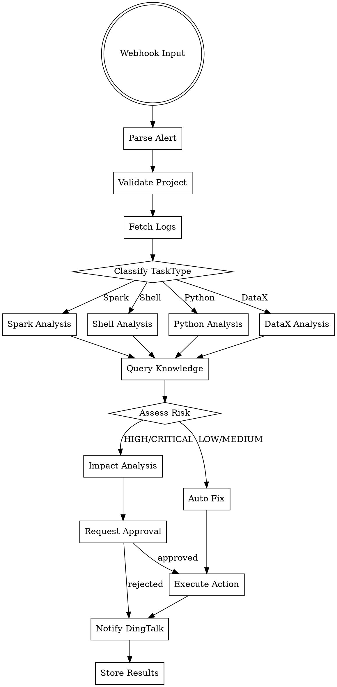
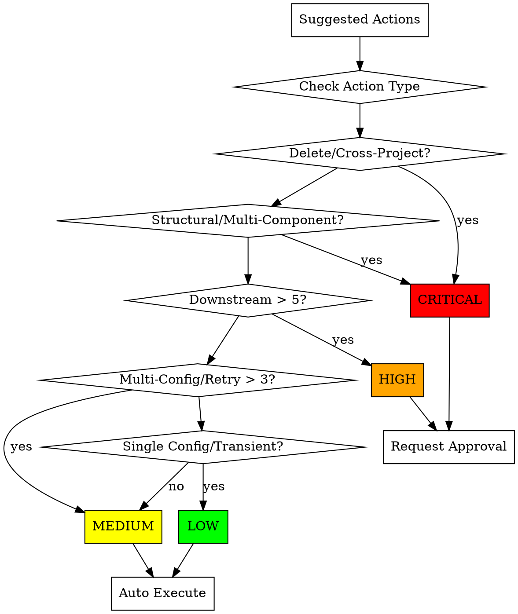

# DolphinScheduler Agent Alert Automation Design

## Overview

This document describes the design for an alert automation system using LangGraph state machine architecture. The system receives DolphinScheduler webhook alerts, analyzes errors using specialized Skills, queries a knowledge base, assesses risk, performs auto-fix for low-risk operations, and sends DingTalk notifications.

## Part 1: Overall Architecture

### LangGraph State Machine Flow



### Component Overview

| Component | Responsibility |
|-----------|---------------|
| **AlertReceiver** | Receives webhook, parses alert JSON, validates project token |
| **LogFetcher** | Coordinates log retrieval from dsctl CLI, Spark History, YARN Gateway |
| **SkillRouter** | Routes to appropriate Skill based on task type |
| **KnowledgeManager** | Queries confirmed.json, manages pending.json entries |
| **RiskAssessor** | Evaluates operation risk level based on rules |
| **ImpactAnalyzer** | Calculates downstream task count for HIGH/CRITICAL operations |
| **ApprovalManager** | Handles approval requests via DingTalk interactive messages |
| **ActionExecutor** | Executes approved auto-fix actions via dsctl CLI |
| **DingTalkNotifier** | Sends notifications with result summaries |
| **LogStorage** | Stores logs with 7-day retention, auto cleanup |

---

## Part 2: AgentState TypedDict

### State Structure

```python
from typing import TypedDict, Literal, Optional, List, Dict, Any
from langgraph.graph import StateGraph

class AgentState(TypedDict):
    # === Input Stage ===
    alert_raw: Dict[str, Any]          # Original webhook JSON
    project_code: str                   # Extracted project code
    workflow_code: str                  # Extracted workflow code
    task_code: str                      # Extracted task code
    task_type: Literal["SHELL", "SPARK", "PYTHON", "DATAX"]
    error_time: str                     # Alert timestamp

    # === Validation Stage ===
    project_valid: bool                 # Project token verified
    project_config: Optional[Dict]      # Project-specific configuration

    # === Log Fetch Stage ===
    driver_logs: Optional[str]          # Logs from dsctl CLI
    spark_logs: Optional[str]           # Logs from Spark History Server
    yarn_logs: Optional[str]            # Logs from YARN Gateway
    log_fetch_error: Optional[str]      # Error message if log fetch failed

    # === Analysis Stage ===
    error_patterns: List[str]           # Matched error patterns from Skill
    error_category: str                 # Error category classification
    suggested_actions: List[Dict]       # Suggested fix actions
    knowledge_match: Optional[Dict]     # Matched knowledge entry
    confidence_score: float             # Analysis confidence (0-1)

    # === Risk Assessment Stage ===
    risk_level: Literal["LOW", "MEDIUM", "HIGH", "CRITICAL"]
    risk_factors: List[str]             # Factors contributing to risk
    downstream_tasks: int               # Count of downstream affected tasks
    impact_summary: Optional[str]       # Impact description for HIGH/CRITICAL

    # === Approval Stage ===
    approval_required: bool             # Whether approval is needed
    approval_status: Optional[Literal["pending", "approved", "rejected"]]
    approval_message_id: Optional[str]  # DingTalk message ID for tracking

    # === Execution Stage ===
    executed_actions: List[Dict]        # Actions that were executed
    execution_results: List[Dict]       # Results of each action
    execution_success: bool             # Overall execution success

    # === Notification Stage ===
    notification_sent: bool             # DingTalk notification status
    notification_content: Optional[str] # Notification message content

    # === Storage Stage ===
    log_stored: bool                    # Logs saved to storage
    result_stored: bool                 # Analysis results saved
```

### State Flow Through Nodes

| Node | Input Fields | Output Fields |
|------|-------------|---------------|
| `parse_alert` | alert_raw | project_code, workflow_code, task_code, task_type, error_time |
| `validate_project` | project_code | project_valid, project_config |
| `fetch_logs` | workflow_code, task_code, project_config | driver_logs, spark_logs, yarn_logs, log_fetch_error |
| `route_skill` | task_type | (routing decision, no state change) |
| `analyze_*` | driver_logs, spark_logs, yarn_logs | error_patterns, error_category, suggested_actions, confidence_score |
| `query_knowledge` | error_patterns, error_category | knowledge_match |
| `assess_risk` | suggested_actions, downstream_tasks | risk_level, risk_factors, approval_required |
| `impact_analysis` | workflow_code, task_code, risk_level | downstream_tasks, impact_summary |
| `request_approval` | suggested_actions, impact_summary, risk_level | approval_status, approval_message_id |
| `execute_action` | suggested_actions, approval_status | executed_actions, execution_results, execution_success |
| `notify_dingtalk` | execution_results, risk_level, error_category | notification_sent, notification_content |
| `store_results` | driver_logs, spark_logs, yarn_logs, execution_results | log_stored, result_stored |

---

## Part 3: Skills Detailed Design

### BaseSkill Interface

```python
from abc import ABC, abstractmethod
from typing import List, Dict, Any, Optional
from dataclasses import dataclass

@dataclass
class ErrorPattern:
    pattern: str                        # Regex pattern to match
    category: str                       # Error category
    severity: str                       # LOW, MEDIUM, HIGH, CRITICAL
    description: str                    # Human-readable description
    auto_fix_rules: List[Dict]          # Applicable auto-fix actions

@dataclass
class AutoFixRule:
    action_type: str                    # rerun, recover-failed, force-success, config-change
    conditions: Dict[str, Any]          # Conditions to apply this fix
    risk_level: str                     # Risk level of this action
    description: str                    # What this fix does

class BaseSkill(ABC):
    task_type: str
    error_patterns: List[ErrorPattern]
    auto_fix_rules: List[AutoFixRule]

    @abstractmethod
    def analyze(self, logs: str) -> Dict[str, Any]:
        """Analyze logs and return error patterns, category, suggestions."""
        pass

    @abstractmethod
    def suggest_actions(self, error_info: Dict) -> List[Dict]:
        """Generate suggested actions based on error analysis."""
        pass

    def match_patterns(self, logs: str) -> List[ErrorPattern]:
        """Match logs against error patterns."""
        matched = []
        for pattern in self.error_patterns:
            if re.search(pattern.pattern, logs, re.IGNORECASE | re.MULTILINE):
                matched.append(pattern)
        return matched
```

### SparkSkill

**Error Patterns:**

| Pattern | Category | Severity | Description |
|---------|----------|----------|-------------|
| `ClassNotFound|ClassNotFoundException` | CONFIG | HIGH | Missing class in Spark jars |
| `OutOfMemoryError|OOM` | RESOURCE | HIGH | Memory insufficient |
| `SparkException: Task failed` | EXECUTION | MEDIUM | Task execution failure |
| `Stage \d+ failed` | EXECUTION | MEDIUM | Spark stage failure |
| `Shuffle fetch failed` | NETWORK | MEDIUM | Shuffle data fetch failure |
| `Container killed by YARN` | RESOURCE | HIGH | YARN container killed |
| `Executor lost` | RESOURCE | MEDIUM | Spark executor lost |
| `Connection refused|ConnectException` | NETWORK | HIGH | Network connection failure |
| `HDFS.*does not exist|FileNotFound` | DATA | MEDIUM | Input file not found |
| `Schema mismatch|cannot resolve` | DATA | HIGH | Schema/data type mismatch |
| `Partition not found` | DATA | MEDIUM | Partition missing |
| `BroadcastHashJoin.*timeout` | PERFORMANCE | LOW | Broadcast join timeout |
| `Skewed partition` | PERFORMANCE | LOW | Data skew detected |
| `Spark config.*invalid` | CONFIG | MEDIUM | Invalid Spark configuration |
| `Driver disconnected` | NETWORK | HIGH | Spark driver disconnected |
| `Application submission failed` | SUBMISSION | HIGH | Failed to submit Spark app |
| `Killed by user` | USER_ACTION | LOW | Manually killed |

**Auto-Fix Rules:**

```python
SPARK_AUTO_FIX_RULES = [
    {
        "action_type": "config-change",
        "conditions": {"error": "OutOfMemoryError", "component": "executor"},
        "config_key": "spark.executor.memory",
        "config_op": "increase",
        "risk_level": "LOW",
        "description": "Increase executor memory by 50%"
    },
    {
        "action_type": "config-change",
        "conditions": {"error": "OutOfMemoryError", "component": "driver"},
        "config_key": "spark.driver.memory",
        "config_op": "increase",
        "risk_level": "LOW",
        "description": "Increase driver memory by 50%"
    },
    {
        "action_type": "rerun",
        "conditions": {"error": "Connection refused", "retry_count": "<3"},
        "risk_level": "MEDIUM",
        "description": "Retry workflow (transient network error)"
    },
    {
        "action_type": "recover-failed",
        "conditions": {"error": "Stage failed", "upstream_success": true},
        "risk_level": "MEDIUM",
        "description": "Recover from failed task"
    },
    {
        "action_type": "rerun",
        "conditions": {"error": "FileNotFound", "file_exists_now": true},
        "risk_level": "LOW",
        "description": "Rerun if input file now exists"
    },
    {
        "action_type": "config-change",
        "conditions": {"error": "BroadcastHashJoin timeout"},
        "config_key": "spark.sql.autoBroadcastJoinThreshold",
        "config_op": "disable",
        "risk_level": "LOW",
        "description": "Disable broadcast join for large tables"
    }
]
```

### ShellSkill

**Error Patterns:**

| Pattern | Category | Severity | Description |
|---------|----------|----------|-------------|
| `command not found|No such file or directory` | SCRIPT | HIGH | Missing command or file |
| `Permission denied|cannot access` | PERMISSION | HIGH | Permission/access denied |
| `exit code \d+|Exit status` | EXECUTION | MEDIUM | Non-zero exit code |
| `syntax error|unexpected token` | SCRIPT | HIGH | Shell syntax error |
| `timeout|TIMEOUT` | TIMEOUT | MEDIUM | Command timeout |
| `Segmentation fault|SIGSEGV` | SYSTEM | CRITICAL | System crash |
| `disk full|No space left` | RESOURCE | HIGH | Disk space exhausted |
| `memory allocation failed` | RESOURCE | HIGH | Memory allocation failure |
| `Too many open files` | RESOURCE | MEDIUM | File descriptor limit |
| `Broken pipe|SIGPIPE` | PIPE | LOW | Pipe broken |
| `Argument list too long` | LIMIT | MEDIUM | Argument limit exceeded |
| `Variable undefined|not set` | SCRIPT | MEDIUM | Undefined variable |
| `Loops indefinitely|infinite loop` | EXECUTION | HIGH | Infinite loop detected |
| `Process killed|SIGKILL` | RESOURCE | MEDIUM | Process killed by system |
| `SSH.*failed|Connection timed out` | NETWORK | HIGH | SSH connection failure |

**Auto-Fix Rules:**

```python
SHELL_AUTO_FIX_RULES = [
    {
        "action_type": "rerun",
        "conditions": {"error": "timeout", "duration": "<expected"},
        "risk_level": "LOW",
        "description": "Rerun with extended timeout"
    },
    {
        "action_type": "rerun",
        "conditions": {"error": "Broken pipe", "upstream_success": true},
        "risk_level": "LOW",
        "description": "Rerun (transient pipe error)"
    },
    {
        "action_type": "rerun",
        "conditions": {"error": "Connection timed out", "retry_count": "<3"},
        "risk_level": "MEDIUM",
        "description": "Retry for transient network errors"
    },
    {
        "action_type": "recover-failed",
        "conditions": {"error": "exit code", "exit_code": "<5", "upstream_success": true},
        "risk_level": "MEDIUM",
        "description": "Recover for minor exit codes"
    }
]
```

### PythonSkill

**Error Patterns:**

| Pattern | Category | Severity | Description |
|---------|----------|----------|-------------|
| `ImportError|ModuleNotFoundError` | IMPORT | HIGH | Missing Python module |
| `SyntaxError|IndentationError` | SCRIPT | HIGH | Python syntax error |
| `TypeError|AttributeError` | LOGIC | MEDIUM | Type/attribute error |
| `KeyError|IndexError` | DATA | MEDIUM | Key/index not found |
| `ValueError|AssertionError` | VALIDATION | MEDIUM | Value/assertion failure |
| `ZeroDivisionError|ArithmeticError` | LOGIC | LOW | Arithmetic error |
| `MemoryError` | RESOURCE | HIGH | Python memory exhausted |
| `RecursionError|maximum recursion` | LOGIC | HIGH | Infinite recursion |
| `ConnectionError|requests.exceptions` | NETWORK | MEDIUM | HTTP/connection error |
| `TimeoutError|ReadTimeout` | TIMEOUT | MEDIUM | Request timeout |
| `JSONDecodeError|json.decoder` | DATA | MEDIUM | JSON parsing error |
| `FileNotFoundError|IOError` | DATA | MEDIUM | File not found |
| `PermissionError|OSError.*permission` | PERMISSION | HIGH | File permission error |
| `EncodingError|UnicodeDecodeError` | DATA | LOW | Encoding error |
| `PickleError|pickle.*failed` | DATA | MEDIUM | Serialization error |
| `DatabaseError|sqlite3|pymysql` | DATABASE | HIGH | Database operation error |
| `DataFrame.*error|pandas.errors` | DATA | MEDIUM | Pandas DataFrame error |
| `ThreadPool.*error|concurrent.futures` | EXECUTION | MEDIUM | Thread pool error |

**Auto-Fix Rules:**

```python
PYTHON_AUTO_FIX_RULES = [
    {
        "action_type": "rerun",
        "conditions": {"error": "ConnectionError", "retry_count": "<3"},
        "risk_level": "MEDIUM",
        "description": "Retry for transient connection errors"
    },
    {
        "action_type": "rerun",
        "conditions": {"error": "TimeoutError", "timeout_config": "<max"},
        "risk_level": "LOW",
        "description": "Rerun with extended timeout"
    },
    {
        "action_type": "recover-failed",
        "conditions": {"error": "KeyError", "upstream_success": true, "transient": true},
        "risk_level": "MEDIUM",
        "description": "Recover for transient data errors"
    },
    {
        "action_type": "rerun",
        "conditions": {"error": "JSONDecodeError", "source_fixed": true},
        "risk_level": "LOW",
        "description": "Rerun if source data fixed"
    }
]
```

### DataXSkill

**Error Patterns:**

| Pattern | Category | Severity | Description |
|---------|----------|----------|-------------|
| `DataX.*Exception|Engine.*error` | ENGINE | HIGH | DataX engine failure |
| `JobContainer.*failed` | JOB | HIGH | Job container failure |
| `TaskGroup.*error` | TASK | MEDIUM | Task group error |
| `Reader.*error|Writer.*error` | PLUGIN | HIGH | Reader/Writer plugin error |
| `Connection refused|MySQL.*connect failed` | DATABASE | HIGH | Database connection failure |
| `Table.*not found|Unknown table` | DATA | MEDIUM | Table not found |
| `Column.*not match|Schema mismatch` | DATA | HIGH | Column/schema mismatch |
| `Primary key conflict|Duplicate entry` | DATA | MEDIUM | Duplicate key conflict |
| `Data truncation|Data too long` | DATA | MEDIUM | Data truncation |
| `Null constraint|cannot be null` | DATA | MEDIUM | NULL constraint violation |
| `Speed.*limit|Bps.*exceed` | PERFORMANCE | LOW | Speed limit exceeded |
| `Memory.*exceed|OOM` | RESOURCE | HIGH | Memory limit exceeded |
| `Channel.*error|Channel.*closed` | CHANNEL | MEDIUM | Data channel error |
| `Record.*dirty|dirty record` | DATA | LOW | Dirty record detected |
| `Oracle.*error|ORA-\d+` | DATABASE | HIGH | Oracle database error |
| `PostgreSQL.*error|PSQLException` | DATABASE | HIGH | PostgreSQL error |
| `HDFS.*error|HDFS.*failed` | STORAGE | HIGH | HDFS operation failure |
| `Hive.*error|hive.*exception` | DATABASE | MEDIUM | Hive operation error |
| `FTP.*error|SFTP.*failed` | NETWORK | HIGH | FTP/SFTP connection failure |

**Auto-Fix Rules:**

```python
DATAX_AUTO_FIX_RULES = [
    {
        "action_type": "rerun",
        "conditions": {"error": "Connection refused", "retry_count": "<3"},
        "risk_level": "MEDIUM",
        "description": "Retry for transient database connection"
    },
    {
        "action_type": "rerun",
        "conditions": {"error": "Channel error", "transient": true},
        "risk_level": "LOW",
        "description": "Retry for transient channel errors"
    },
    {
        "action_type": "config-change",
        "conditions": {"error": "Speed limit"},
        "config_key": "setting.speed.byte",
        "config_op": "increase",
        "risk_level": "LOW",
        "description": "Increase speed limit"
    },
    {
        "action_type": "recover-failed",
        "conditions": {"error": "Duplicate entry", "mode": "insert"},
        "risk_level": "MEDIUM",
        "description": "Recover and change to insert ignore mode"
    },
    {
        "action_type": "rerun",
        "conditions": {"error": "dirty record", "dirty_limit": "<threshold"},
        "risk_level": "LOW",
        "description": "Rerun with higher dirty record tolerance"
    }
]
```

---

## Part 4: Tools Detailed Design

### DSCLITool

**Purpose:** Execute dsctl CLI commands to interact with DolphinScheduler API.

**Commands Supported:**

| Command | Purpose | Usage in Agent |
|---------|---------|----------------|
| `workflow-instance list` | List workflow instances | Fetch workflow details |
| `workflow-instance get` | Get workflow instance details | Extract task codes |
| `workflow-instance log` | Get workflow logs | Fetch driver logs |
| `workflow-instance digest` | Get workflow digest | Quick error summary |
| `workflow-instance stop` | Stop running workflow | Manual intervention |
| `workflow-instance rerun` | Rerun workflow | Auto-fix action |
| `workflow-instance recover-failed` | Recover from failed | Auto-fix action |
| `task-instance log` | Get task logs | Fetch task-level logs |
| `task-instance force-success` | Force task success | Auto-fix action |
| `workflow edit` | Edit workflow YAML | Config changes |

**Implementation:**

```python
class DSCLITool:
    def __init__(self, dsctl_path: str, ds_url: str, token: str):
        self.dsctl_path = dsctl_path
        self.ds_url = ds_url
        self.token = token
        self.output_format = "yaml"

    def execute(self, command: str, args: Dict) -> Dict:
        """Execute dsctl command and return result."""
        cmd = self._build_command(command, args)
        result = subprocess.run(cmd, capture_output=True, text=True)
        if result.returncode != 0:
            raise DSCLIError(result.stderr)
        return yaml.safe_load(result.stdout)

    def _build_command(self, command: str, args: Dict) -> List[str]:
        """Build dsctl command with arguments."""
        cmd = [
            self.dsctl_path,
            "--url", self.ds_url,
            "--token", self.token,
            "--output-format", self.output_format,
            command
        ]
        for key, value in args.items():
            cmd.extend([f"--{key}", str(value)])
        return cmd

    def fetch_workflow_logs(self, workflow_code: str) -> str:
        """Fetch workflow instance logs."""
        result = self.execute("workflow-instance log", {"code": workflow_code})
        return result.get("logs", "")

    def fetch_task_logs(self, task_code: str) -> str:
        """Fetch task instance logs."""
        result = self.execute("task-instance log", {"code": task_code})
        return result.get("logs", "")

    def get_workflow_digest(self, workflow_code: str) -> Dict:
        """Get workflow digest for quick analysis."""
        return self.execute("workflow-instance digest", {"code": workflow_code})

    def rerun_workflow(self, workflow_code: str) -> Dict:
        """Rerun a workflow instance."""
        return self.execute("workflow-instance rerun", {"code": workflow_code})

    def recover_failed(self, workflow_code: str) -> Dict:
        """Recover from failed task."""
        return self.execute("workflow-instance recover-failed", {"code": workflow_code})

    def force_success(self, task_code: str) -> Dict:
        """Force task to success status."""
        return self.execute("task-instance force-success", {"code": task_code})
```

### SparkHistTool

**Purpose:** Fetch Spark application logs from Spark History Server.

**Configuration:**

| Field | Value |
|-------|-------|
| Base URL | `ali-odp-test-02.huan.tv:18082` |
| API Path | `/api/v1/applications/{appId}` |
| Endpoints | `/logs`, `/stages`, `/executors` |

**Implementation:**

```python
class SparkHistTool:
    def __init__(self, base_url: str):
        self.base_url = base_url
        self.session = requests.Session()

    def fetch_app_logs(self, app_id: str) -> str:
        """Fetch Spark application logs."""
        url = f"{self.base_url}/api/v1/applications/{app_id}/logs"
        response = self.session.get(url, timeout=30)
        if response.status_code == 200:
            return response.text
        return ""

    def fetch_failed_stages(self, app_id: str) -> List[Dict]:
        """Fetch failed stage information."""
        url = f"{self.base_url}/api/v1/applications/{app_id}/stages"
        params = {"status": "FAILED"}
        response = self.session.get(url, params=params, timeout=30)
        if response.status_code == 200:
            return response.json()
        return []

    def fetch_executor_info(self, app_id: str) -> List[Dict]:
        """Fetch executor status information."""
        url = f"{self.base_url}/api/v1/applications/{app_id}/executors"
        response = self.session.get(url, timeout=30)
        if response.status_code == 200:
            return response.json()
        return []
```

### YARNLogTool

**Purpose:** Fetch YARN container logs via Knox Gateway (Basic Auth).

**Configuration:**

| Field | Value |
|-------|-------|
| Gateway URL | `https://ali-odp-test-01.huan.tv:8443/gateway/default/yarn/cluster` |
| Auth Type | Basic Auth |
| Endpoints | `/containerlogs/{containerId}/stdout`, `/containerlogs/{containerId}/stderr` |

**Implementation:**

```python
class YARNLogTool:
    def __init__(self, gateway_url: str, username: str, password: str):
        self.gateway_url = gateway_url
        self.auth = (username, password)
        self.session = requests.Session()

    def fetch_container_logs(self, container_id: str) -> Dict[str, str]:
        """Fetch container stdout and stderr logs."""
        base = f"{self.gateway_url}/containerlogs/{container_id}"

        stdout_url = f"{base}/stdout?start=-4096"  # Last 4KB
        stderr_url = f"{base}/stderr?start=-4096"

        stdout = self._fetch_log(stdout_url)
        stderr = self._fetch_log(stderr_url)

        return {"stdout": stdout, "stderr": stderr}

    def _fetch_log(self, url: str) -> str:
        """Fetch log from YARN gateway."""
        response = self.session.get(
            url,
            auth=self.auth,
            timeout=30,
            verify=False  # Internal gateway, skip SSL verify
        )
        if response.status_code == 200:
            return response.text
        return ""
```

### LogStoreTool

**Purpose:** Store logs with 7-day retention and auto cleanup.

**Implementation:**

```python
class LogStoreTool:
    def __init__(self, base_path: str = "logs/alerts"):
        self.base_path = base_path
        self.retention_days = 7

    def store_logs(self, workflow_code: str, task_code: str,
                   driver_logs: str, spark_logs: str,
                   yarn_logs: str) -> str:
        """Store logs and return storage path."""
        date_path = datetime.now().strftime("%Y-%m-%d")
        store_path = os.path.join(
            self.base_path, date_path, workflow_code, task_code
        )
        os.makedirs(store_path, exist_ok=True)

        timestamp = datetime.now().strftime("%H%M%S")

        files = {
            "driver.log": driver_logs,
            "spark.log": spark_logs,
            "yarn.log": yarn_logs,
            "metadata.yaml": yaml.dump({
                "workflow_code": workflow_code,
                "task_code": task_code,
                "timestamp": timestamp,
                "sources": ["dsctl", "spark-history", "yarn"]
            })
        }

        for filename, content in files.items():
            with open(os.path.join(store_path, filename), "w") as f:
                f.write(content)

        return store_path

    def cleanup_old_logs(self) -> int:
        """Delete logs older than retention period."""
        cutoff_date = datetime.now() - timedelta(days=self.retention_days)
        cutoff_path = cutoff_date.strftime("%Y-%m-%d")
        deleted_count = 0

        for date_dir in os.listdir(self.base_path):
            if date_dir < cutoff_path:
                dir_path = os.path.join(self.base_path, date_dir)
                shutil.rmtree(dir_path)
                deleted_count += 1

        return deleted_count

    def get_log_path(self, workflow_code: str, task_code: str) -> Optional[str]:
        """Find most recent log path for given workflow/task."""
        for date_dir in sorted(os.listdir(self.base_path), reverse=True):
            potential_path = os.path.join(
                self.base_path, date_dir, workflow_code, task_code
            )
            if os.path.exists(potential_path):
                return potential_path
        return None
```

### DingTalkTool

**Purpose:** Send notifications via DingTalk enterprise robot.

**Configuration:**

| Field | Value |
|-------|-------|
| Client ID | `dingyyink7zqipbyrnf1` |
| Client Secret | `uBn_9NI7eK1Bm3aGIIcnv5cac4g-Imtg_gMV6MJl8rSQ9-I4xIUXt7SQ68vPfN3E` |
| API Endpoint | `https://api.dingtalk.com/v1.0/robot/oToMessages` |

**Implementation:**

```python
import hmac
import hashlib
import base64
import time
import urllib.parse

class DingTalkTool:
    def __init__(self, client_id: str, client_secret: str):
        self.client_id = client_id
        self.client_secret = client_secret
        self.api_url = "https://api.dingtalk.com/v1.0/robot/oToMessages"

    def _generate_signature(self, timestamp: int) -> str:
        """Generate signature for DingTalk API."""
        string_to_sign = f"{timestamp}\n{self.client_secret}"
        hmac_code = hmac.new(
            self.client_secret.encode("utf-8"),
            string_to_sign.encode("utf-8"),
            digestmod=hashlib.sha256
        ).digest()
        sign = urllib.parse.quote_plus(base64.b64encode(hmac_code))
        return sign

    def send_notification(self, webhook_url: str, content: Dict) -> str:
        """Send notification and return message ID."""
        timestamp = int(time.time() * 1000)
        sign = self._generate_signature(timestamp)

        headers = {
            "Content-Type": "application/json",
            "timestamp": str(timestamp),
            "sign": sign
        }

        payload = {
            "msgtype": "interactive",
            "interactive": content
        }

        # For enterprise robot, use webhook URL from project config
        response = requests.post(
            webhook_url,
            headers=headers,
            json=payload,
            timeout=10
        )

        if response.status_code == 200:
            return response.json().get("messageId", "")
        raise DingTalkError(response.text)

    def build_error_notification(self, state: AgentState) -> Dict:
        """Build interactive card for error notification."""
        return {
            "title": f"Alert Analysis: {state['task_type']}",
            "text": f"""
## Error Analysis Result

**Workflow:** {state['workflow_code']}
**Task:** {state['task_code']}
**Type:** {state['task_type']}
**Risk Level:** {state['risk_level']}

### Error Category
{state['error_category']}

### Matched Patterns
{chr(10).join(f'- {p}' for p in state['error_patterns'])}

### Suggested Actions
{chr(10).join(f'- {a["description"]}' for a in state['suggested_actions'])}
            """,
            "singleURL": {
                "url": f"{state['project_config']['ds_url']}/#/workflow/{state['workflow_code']}",
                "text": "View Workflow"
            }
        }

    def build_approval_request(self, state: AgentState) -> Dict:
        """Build interactive card for approval request."""
        return {
            "title": f"Approval Required: {state['risk_level']} Risk",
            "text": f"""
## Action Approval Request

**Workflow:** {state['workflow_code']}
**Task:** {state['task_code']}
**Risk Level:** {state['risk_level']}

### Impact Summary
{state.get('impact_summary', 'N/A')}

### Proposed Actions
{chr(10).join(f'- {a["description"]}' for a in state['suggested_actions'])}

### Risk Factors
{chr(10).join(f'- {f}' for f in state['risk_factors'])}

Please approve or reject these actions.
            """,
            "btns": [
                {"title": "Approve", "actionUrl": "/approval/approve"},
                {"title": "Reject", "actionUrl": "/approval/reject"}
            ]
        }
```

### KnowledgeTool

**Purpose:** Query and manage knowledge base entries.

**Storage Structure:**

```
knowledge/
├── confirmed.json    # Validated entries (human confirmed)
└── pending.json      # Entries awaiting confirmation
```

**Implementation:**

```python
class KnowledgeTool:
    def __init__(self, knowledge_path: str = "knowledge"):
        self.confirmed_path = os.path.join(knowledge_path, "confirmed.json")
        self.pending_path = os.path.join(knowledge_path, "pending.json")
        self._load_knowledge()

    def _load_knowledge(self):
        """Load knowledge files."""
        self.confirmed = self._read_json(self.confirmed_path)
        self.pending = self._read_json(self.pending_path)

    def _read_json(self, path: str) -> List[Dict]:
        """Read JSON file safely."""
        if os.path.exists(path):
            with open(path, "r") as f:
                return json.load(f)
        return []

    def query(self, error_patterns: List[str], task_type: str) -> Optional[Dict]:
        """Query knowledge base for matching entry."""
        for entry in self.confirmed:
            if entry["task_type"] == task_type:
                if any(p in entry["patterns"] for p in error_patterns):
                    return entry
        return None

    def add_pending(self, entry: Dict):
        """Add entry to pending knowledge."""
        self.pending.append(entry)
        self._save_json(self.pending_path, self.pending)

    def confirm_entry(self, entry_id: str):
        """Move pending entry to confirmed."""
        entry = next((e for e in self.pending if e["id"] == entry_id), None)
        if entry:
            self.pending.remove(entry)
            self.confirmed.append(entry)
            self._save_json(self.pending_path, self.pending)
            self._save_json(self.confirmed_path, self.confirmed)

    def _save_json(self, path: str, data: List[Dict]):
        """Save JSON file."""
        with open(path, "w") as f:
            json.dump(data, f, indent=2)
```

### ApprovalTool

**Purpose:** Handle approval workflow for HIGH/CRITICAL operations.

**Implementation:**

```python
class ApprovalTool:
    def __init__(self, dingtalk: DingTalkTool, approval_timeout: int = 3600):
        self.dingtalk = dingtalk
        self.approval_timeout = approval_timeout
        self.pending_approvals = {}  # In-memory tracking

    def request_approval(self, state: AgentState) -> str:
        """Send approval request and track it."""
        message_id = self.dingtalk.send_notification(
            state['project_config']['dingtalk_webhook'],
            self.dingtalk.build_approval_request(state)
        )

        self.pending_approvals[message_id] = {
            "state": state,
            "requested_at": datetime.now(),
            "status": "pending"
        }

        return message_id

    def check_approval(self, message_id: str) -> Optional[str]:
        """Check approval status for a message."""
        approval = self.pending_approvals.get(message_id)
        if not approval:
            return None

        # Check timeout
        elapsed = (datetime.now() - approval["requested_at"]).seconds
        if elapsed > self.approval_timeout:
            approval["status"] = "timeout"
            return "timeout"

        return approval["status"]

    def process_response(self, message_id: str, response: str):
        """Process approval response from DingTalk."""
        approval = self.pending_approvals.get(message_id)
        if approval:
            approval["status"] = response  # "approved" or "rejected"
```

### ImpactTool

**Purpose:** Analyze downstream task impact for HIGH/CRITICAL operations.

**Implementation:**

```python
class ImpactTool:
    def __init__(self, dscli: DSCLITool):
        self.dscli = dscli

    def analyze_downstream(self, workflow_code: str, task_code: str) -> Dict:
        """Calculate downstream task count and impact."""
        # Get workflow DAG structure
        workflow = self.dscli.execute(
            "workflow-instance get",
            {"code": workflow_code}
        )

        # Parse task dependencies
        dag = workflow.get("dag", {})
        tasks = dag.get("tasks", [])
        edges = dag.get("edges", [])

        # Find downstream tasks
        downstream = self._find_downstream_tasks(task_code, edges)
        downstream_count = len(downstream)

        # Build impact summary
        impact_summary = self._build_impact_summary(
            task_code, downstream, downstream_count
        )

        return {
            "downstream_tasks": downstream_count,
            "downstream_list": downstream,
            "impact_summary": impact_summary
        }

    def _find_downstream_tasks(self, task_code: str, edges: List) -> List[str]:
        """Find all downstream dependent tasks."""
        downstream = set()
        to_process = [task_code]

        while to_process:
            current = to_process.pop()
            for edge in edges:
                if edge["from"] == current:
                    downstream_task = edge["to"]
                    if downstream_task not in downstream:
                        downstream.add(downstream_task)
                        to_process.append(downstream_task)

        return list(downstream)

    def _build_impact_summary(self, task_code: str,
                               downstream: List[str],
                               count: int) -> str:
        """Build human-readable impact summary."""
        if count == 0:
            return f"Task {task_code} has no downstream dependencies."

        return f"""
Task {task_code} affects {count} downstream tasks:
{chr(10).join(f'- {t}' for t in downstream[:10])}
{(f'... and {count - 10} more' if count > 10 else '')}
"""
```

### RiskAssessTool

**Purpose:** Evaluate operation risk level based on defined rules.

**Implementation:**

```python
class RiskAssessTool:
    def __init__(self):
        self.risk_rules = {
            "LOW": [
                {"action": "config-change", "single_param": True},
                {"action": "rerun", "transient": True},
                {"action": "force-success", "no_downstream": True}
            ],
            "MEDIUM": [
                {"action": "config-change", "multi_param": True},
                {"action": "rerun", "retry_count": ">3"},
                {"action": "recover-failed", "downstream": "<5"}
            ],
            "HIGH": [
                {"action": "recover-failed", "downstream": ">5"},
                {"action": "config-change", "structural": True},
                {"action": "rerun", "schedule_change": True}
            ],
            "CRITICAL": [
                {"action": "delete"},
                {"action": "cross_project"},
                {"action": "structural", "multiple_components": True}
            ]
        }

    def assess(self, suggested_actions: List[Dict],
               downstream_count: int,
               task_type: str) -> Dict:
        """Assess risk level for proposed actions."""
        max_risk = "LOW"
        risk_factors = []

        for action in suggested_actions:
            action_risk = self._assess_action(
                action, downstream_count, task_type
            )
            risk_factors.append(f"{action['action_type']}: {action_risk}")

            if self._risk_level_value(action_risk) > self._risk_level_value(max_risk):
                max_risk = action_risk

        return {
            "risk_level": max_risk,
            "risk_factors": risk_factors,
            "approval_required": max_risk in ["HIGH", "CRITICAL"]
        }

    def _assess_action(self, action: Dict,
                        downstream_count: int,
                        task_type: str) -> str:
        """Assess single action risk."""
        action_type = action.get("action_type")

        # Check CRITICAL conditions
        if action_type in ["delete", "cross_project"]:
            return "CRITICAL"

        # Check HIGH conditions
        if action_type == "recover-failed" and downstream_count > 5:
            return "HIGH"
        if action_type == "config-change" and action.get("structural"):
            return "HIGH"

        # Check MEDIUM conditions
        if action_type == "config-change" and action.get("multi_param"):
            return "MEDIUM"
        if action_type == "rerun" and action.get("retry_count", 0) > 3:
            return "MEDIUM"

        # Default LOW
        return "LOW"

    def _risk_level_value(self, level: str) -> int:
        """Convert risk level to numeric value."""
        return {"LOW": 1, "MEDIUM": 2, "HIGH": 3, "CRITICAL": 4}.get(level, 0)
```

---

## Part 5: Risk Assessment Rules and Approval Workflow

### Risk Level Definitions

| Level | Criteria | Approval Required | Example Actions |
|-------|----------|-------------------|-----------------|
| **LOW** | Single config change, transient retry, no downstream impact | No | Increase memory, retry once, disable broadcast join |
| **MEDIUM** | Multi-config change, repeated retry, limited downstream (<5) | No | Modify multiple Spark params, retry 3+ times, recover with few downstream |
| **HIGH** | Structural changes, significant downstream (>5), schedule modification | Yes | Recover-failed with many downstream, structural config change |
| **CRITICAL** | Delete operations, cross-project impact, multiple structural changes | Yes | Delete workflow, cross-project recovery, multi-component structural change |

### Risk Assessment Flow



### Approval Workflow

**Process:**

1. Risk assessment returns HIGH or CRITICAL
2. ImpactAnalyzer calculates downstream tasks
3. ApprovalTool sends DingTalk interactive message
4. User clicks Approve/Reject button
5. ApprovalTool receives response callback
6. If approved: ExecuteAction node proceeds
7. If rejected: Notify DingTalk with rejection, no action taken
8. If timeout (1 hour): Mark as expired, notify timeout

**DingTalk Interactive Card:**

```
┌─────────────────────────────────────────┐
│ Approval Required: HIGH Risk            │
├─────────────────────────────────────────┤
│ Workflow: agent-test                     │
│ Task: spark-transform                    │
│ Risk Level: HIGH                         │
│                                          │
│ Impact Summary:                          │
│ Task spark-transform affects 12          │
│ downstream tasks:                        │
│ - data-validate                          │
│ - hive-load                              │
│ - mysql-export                           │
│ ... and 9 more                           │
│                                          │
│ Proposed Actions:                        │
│ - Recover from failed task               │
│                                          │
│ Risk Factors:                            │
│ - recover-failed: HIGH                   │
│                                          │
│ [Approve]  [Reject]                      │
└─────────────────────────────────────────┘
```

---

## Part 6: Log Storage and Cleanup Strategy

### Directory Structure

```
logs/
├── alerts/
│   ├── 2026-05-07/
│   │   ├── workflow_code_1/
│   │   │   ├── task_code_1/
│   │   │   │   ├── driver.log        # dsctl CLI logs
│   │   │   │   ├── spark.log         # Spark History logs
│   │   │   │   ├── yarn.log          # YARN Gateway logs
│   │   │   │   └── metadata.yaml     # Metadata
│   │   │   └── task_code_2/
│   │   │       └── ...
│   │   └── workflow_code_2/
│   │       └── ...
│   ├── 2026-05-08/
│   │   └── ...
│   └── ... (date directories)
└── cleanup.log                           # Cleanup history
```

### Metadata File Structure

```yaml
workflow_code: "21451302002208"
task_code: "12345678901234"
timestamp: "143052"                        # HHMMSS
sources:
  - dsctl
  - spark-history
  - yarn
error_category: "RESOURCE"
risk_level: "HIGH"
actions_executed:
  - action_type: "recover-failed"
    result: "success"
notification_sent: true
```

### Cleanup Strategy

**Implementation:**

```python
# Scheduled cleanup task (runs daily at midnight)
def cleanup_old_logs():
    tool = LogStoreTool()
    deleted = tool.cleanup_old_logs()

    # Log cleanup result
    with open("logs/cleanup.log", "a") as f:
        f.write(f"{datetime.now()}: Deleted {deleted} date directories\n")

    return deleted
```

**Cleanup Rules:**

| Rule | Implementation |
|------|----------------|
| Retention period | 7 days from creation date |
| Cleanup frequency | Daily at 00:00 |
| Cleanup scope | Entire date directory |
| Logging | Append to cleanup.log |

**Startup Cleanup Check:**

```python
def on_startup():
    """Check and run cleanup if needed on agent startup."""
    tool = LogStoreTool()

    # Check if cleanup needed (missed scheduled cleanup)
    latest_date = max(os.listdir(tool.base_path)) if os.listdir(tool.base_path) else None
    if latest_date:
        latest = datetime.strptime(latest_date, "%Y-%m-%d")
        if datetime.now() - latest > timedelta(days=tool.retention_days):
            cleanup_old_logs()
```

---

## Implementation Notes

### Phase 1 Scope

- Knowledge feedback loop: **Skipped** (entries go directly to confirmed.json)
- Approval timeout: 1 hour
- DingTalk outgoing messages: **Deprecated** (only notifications)
- Log sources: dsctl CLI + Spark History + YARN Gateway (mixed)

### DS 3.2.0 API Adaptation

The dsctl CLI needs adaptation for DolphinScheduler 3.2.0:
- Use `process-*` endpoints instead of `workflow-*` (3.4.x naming)
- State parameter expects integer, not string (needs mapping)
- Some operations may have different response structure

### Next Steps

1. Implement LangGraph state machine nodes
2. Implement Skills (SparkSkill, ShellSkill, PythonSkill, DataXSkill)
3. Implement Tools (DSCLITool, SparkHistTool, YARNLogTool, etc.)
4. Implement main.py webhook handler
5. Add tests for each component
6. Deploy and test with ad_monitor project