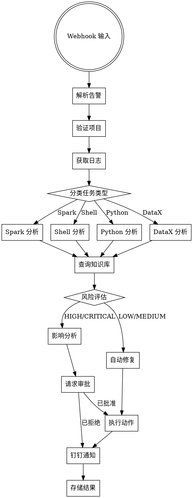
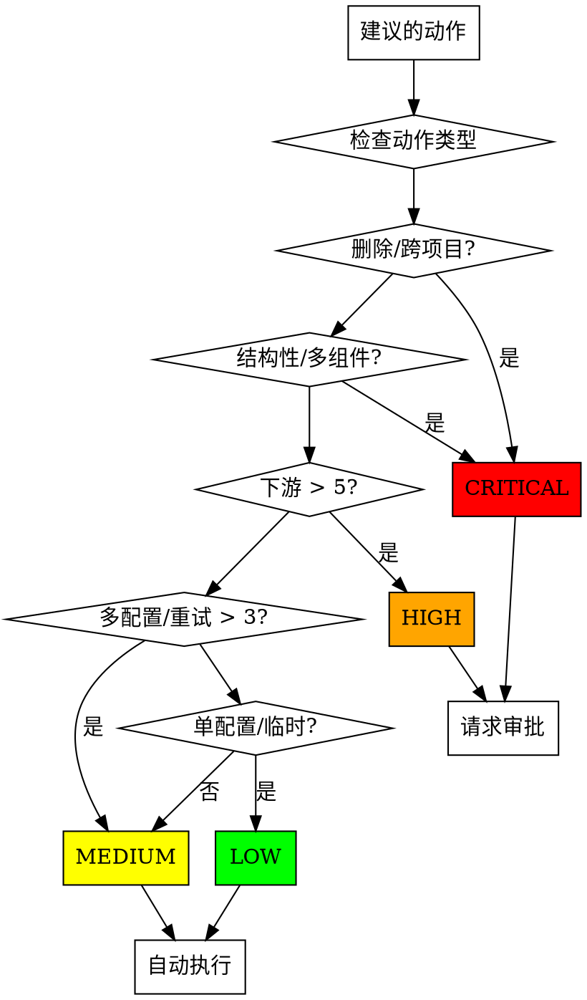

# DolphinScheduler Agent 告警自动化设计文档

## 概述

本文档描述基于 LangGraph 状态机架构的告警自动化系统设计。系统接收 DolphinScheduler webhook 告警，使用专业化的 Skills 分析错误，查询知识库，评估风险等级，对低风险操作执行自动修复，并发送钉钉通知。

## 第一部分：整体架构

### LangGraph 状态机流程



### 组件概览

| 组件 | 职责 |
|------|------|
| **AlertReceiver** | 接收 webhook，解析告警 JSON，验证项目 token |
| **LogFetcher** | 协调日志获取：dsctl CLI、Spark History、YARN Gateway/K8s API |
| **SkillRouter** | 根据任务类型路由到对应的 Skill |
| **KnowledgeManager** | 查询 confirmed.json，管理 pending.json 条目 |
| **RiskAssessor** | 根据规则评估操作风险等级 |
| **ImpactAnalyzer** | 计算 HIGH/CRITICAL 操作的下游任务数量 |
| **ApprovalManager** | 通过钉钉交互消息处理审批请求 |
| **ActionExecutor** | 通过 dsctl CLI 执行已批准的自动修复动作 |
| **DingTalkNotifier** | 发送包含结果摘要的通知 |
| **LogStorage** | 存储日志，保留 7 天，自动清理 |

---

## 第二部分：AgentState 状态结构

### 状态定义

```python
from typing import TypedDict, Literal, Optional, List, Dict, Any
from langgraph.graph import StateGraph

class AgentState(TypedDict):
    # === 输入阶段 ===
    alert_raw: Dict[str, Any]          # 原始 webhook JSON
    project_code: str                   # 提取的项目编码
    workflow_code: str                  # 提取的工作流编码
    task_code: str                      # 提取的任务编码
    task_type: Literal["SHELL", "SPARK", "PYTHON", "DATAX"]
    error_time: str                     # 告警时间戳

    # === 验证阶段 ===
    project_valid: bool                 # 项目 token 已验证
    project_config: Optional[Dict]      # 项目特定配置

    # === 日志获取阶段 ===
    driver_logs: Optional[str]          # dsctl CLI 日志
    spark_logs: Optional[str]           # Spark History Server 日志（YARN/K8s 都可用）
    yarn_logs: Optional[str]            # YARN Gateway 日志（Spark on YARN）
    k8s_logs: Optional[Dict[str, str]]  # K8s Pod 日志（Spark on K8s）
    log_fetch_error: Optional[str]      # 日志获取失败时的错误信息

    # === 分析阶段 ===
    error_patterns: List[str]           # Skill 匹配的错误模式
    error_category: str                 # 错误分类
    suggested_actions: List[Dict]       # 建议的修复动作
    knowledge_match: Optional[Dict]     # 匹配的知识库条目
    confidence_score: float             # 分析置信度 (0-1)

    # === 风险评估阶段 ===
    risk_level: Literal["LOW", "MEDIUM", "HIGH", "CRITICAL"]
    risk_factors: List[str]             # 影响风险的因素
    downstream_tasks: int               # 受影响的下游任务数量
    impact_summary: Optional[str]       # HIGH/CRITICAL 的影响描述

    # === 审批阶段 ===
    approval_required: bool             # 是否需要审批
    approval_status: Optional[Literal["pending", "approved", "rejected"]]
    approval_message_id: Optional[str]  # 钉钉消息 ID 用于追踪

    # === 执行阶段 ===
    executed_actions: List[Dict]        # 已执行的动作
    execution_results: List[Dict]       # 每个动作的结果
    execution_success: bool             # 整体执行是否成功

    # === 通知阶段 ===
    notification_sent: bool             # 钉钉通知状态
    notification_content: Optional[str] # 通知消息内容

    # === 存储阶段 ===
    log_stored: bool                    # 日志已保存
    result_stored: bool                 # 分析结果已保存
```

### 状态在各节点的流转

| 节点 | 输入字段 | 输出字段 |
|------|---------|---------|
| `parse_alert` | alert_raw | project_code, workflow_code, task_code, task_type, error_time |
| `validate_project` | project_code | project_valid, project_config |
| `fetch_logs` | workflow_code, task_code, project_config | driver_logs, spark_logs, yarn_logs/k8s_logs, log_fetch_error |
| `route_skill` | task_type | (路由决策，不改变状态) |
| `analyze_*` | driver_logs, spark_logs, yarn_logs/k8s_logs | error_patterns, error_category, suggested_actions, confidence_score |
| `query_knowledge` | error_patterns, error_category | knowledge_match |
| `assess_risk` | suggested_actions, downstream_tasks | risk_level, risk_factors, approval_required |
| `impact_analysis` | workflow_code, task_code, risk_level | downstream_tasks, impact_summary |
| `request_approval` | suggested_actions, impact_summary, risk_level | approval_status, approval_message_id |
| `execute_action` | suggested_actions, approval_status | executed_actions, execution_results, execution_success |
| `notify_dingtalk` | execution_results, risk_level, error_category | notification_sent, notification_content |
| `store_results` | driver_logs, spark_logs, yarn_logs/k8s_logs, execution_results | log_stored, result_stored |

---

## 第三部分：Skills 详细设计

### BaseSkill 接口

```python
from abc import ABC, abstractmethod
from typing import List, Dict, Any, Optional
from dataclasses import dataclass

@dataclass
class ErrorPattern:
    pattern: str                        # 正则匹配模式
    category: str                       # 错误分类
    severity: str                       # 严重程度：LOW, MEDIUM, HIGH, CRITICAL
    description: str                    # 人类可读描述
    auto_fix_rules: List[Dict]          # 可应用的自动修复规则

@dataclass
class AutoFixRule:
    action_type: str                    # 动作类型：rerun, recover-failed, force-success, config-change
    conditions: Dict[str, Any]          # 应用此修复的条件
    risk_level: str                     # 此动作的风险等级
    description: str                    # 修复描述

class BaseSkill(ABC):
    task_type: str
    error_patterns: List[ErrorPattern]
    auto_fix_rules: List[AutoFixRule]

    @abstractmethod
    def analyze(self, logs: str) -> Dict[str, Any]:
        """分析日志并返回错误模式、分类、建议"""
        pass

    @abstractmethod
    def suggest_actions(self, error_info: Dict) -> List[Dict]:
        """根据错误分析生成建议动作"""
        pass

    def match_patterns(self, logs: str) -> List[ErrorPattern]:
        """匹配日志中的错误模式"""
        matched = []
        for pattern in self.error_patterns:
            if re.search(pattern.pattern, logs, re.IGNORECASE | re.MULTILINE):
                matched.append(pattern)
        return matched
```

### SparkSkill

**错误模式：**

| 模式 | 分类 | 严重程度 | 描述 |
|------|------|---------|------|
| `ClassNotFound|ClassNotFoundException` | CONFIG | HIGH | Spark jars 缺少类 |
| `OutOfMemoryError|OOM` | RESOURCE | HIGH | 内存不足 |
| `SparkException: Task failed` | EXECUTION | MEDIUM | 任务执行失败 |
| `Stage \d+ failed` | EXECUTION | MEDIUM | Spark Stage 失败 |
| `Shuffle fetch failed` | NETWORK | MEDIUM | Shuffle 数据获取失败 |
| `Container killed by YARN` | RESOURCE | HIGH | YARN 容器被杀 |
| `Executor lost` | RESOURCE | MEDIUM | Spark Executor 丢失 |
| `Connection refused|ConnectException` | NETWORK | HIGH | 网络连接失败 |
| `HDFS.*does not exist|FileNotFound` | DATA | MEDIUM | 输入文件不存在 |
| `Schema mismatch|cannot resolve` | DATA | HIGH | Schema/数据类型不匹配 |
| `Partition not found` | DATA | MEDIUM | 分区缺失 |
| `BroadcastHashJoin.*timeout` | PERFORMANCE | LOW | Broadcast join 超时 |
| `Skewed partition` | PERFORMANCE | LOW | 数据倾斜检测 |
| `Spark config.*invalid` | CONFIG | MEDIUM | 无效的 Spark 配置 |
| `Driver disconnected` | NETWORK | HIGH | Spark Driver 断连 |
| `Application submission failed` | SUBMISSION | HIGH | 提交 Spark 应用失败 |
| `Killed by user` | USER_ACTION | LOW | 手动终止 |

**自动修复规则：**

```python
SPARK_AUTO_FIX_RULES = [
    {
        "action_type": "config-change",
        "conditions": {"error": "OutOfMemoryError", "component": "executor"},
        "config_key": "spark.executor.memory",
        "config_op": "increase",
        "risk_level": "LOW",
        "description": "增加 Executor 内存 50%"
    },
    {
        "action_type": "config-change",
        "conditions": {"error": "OutOfMemoryError", "component": "driver"},
        "config_key": "spark.driver.memory",
        "config_op": "increase",
        "risk_level": "LOW",
        "description": "增加 Driver 内存 50%"
    },
    {
        "action_type": "rerun",
        "conditions": {"error": "Connection refused", "retry_count": "<3"},
        "risk_level": "MEDIUM",
        "description": "重试工作流（临时网络错误）"
    },
    {
        "action_type": "recover-failed",
        "conditions": {"error": "Stage failed", "upstream_success": true},
        "risk_level": "MEDIUM",
        "description": "从失败任务恢复"
    },
    {
        "action_type": "rerun",
        "conditions": {"error": "FileNotFound", "file_exists_now": true},
        "risk_level": "LOW",
        "description": "输入文件已存在，重试"
    },
    {
        "action_type": "config-change",
        "conditions": {"error": "BroadcastHashJoin timeout"},
        "config_key": "spark.sql.autoBroadcastJoinThreshold",
        "config_op": "disable",
        "risk_level": "LOW",
        "description": "禁用大表的 Broadcast Join"
    }
]
```

### ShellSkill

**错误模式：**

| 模式 | 分类 | 严重程度 | 描述 |
|------|------|---------|------|
| `command not found|No such file or directory` | SCRIPT | HIGH | 命令或文件不存在 |
| `Permission denied|cannot access` | PERMISSION | HIGH | 权限/访问拒绝 |
| `exit code \d+|Exit status` | EXECUTION | MEDIUM | 非零退出码 |
| `syntax error|unexpected token` | SCRIPT | HIGH | Shell 语法错误 |
| `timeout|TIMEOUT` | TIMEOUT | MEDIUM | 命令超时 |
| `Segmentation fault|SIGSEGV` | SYSTEM | CRITICAL | 系统崩溃 |
| `disk full|No space left` | RESOURCE | HIGH | 磁盘空间耗尽 |
| `memory allocation failed` | RESOURCE | HIGH | 内存分配失败 |
| `Too many open files` | RESOURCE | MEDIUM | 文件描述符限制 |
| `Broken pipe|SIGPIPE` | PIPE | LOW | Pipe 断裂 |
| `Argument list too long` | LIMIT | MEDIUM | 参数列表超长 |
| `Variable undefined|not set` | SCRIPT | MEDIUM | 未定义变量 |
| `Loops indefinitely|infinite loop` | EXECUTION | HIGH | 无限循环检测 |
| `Process killed|SIGKILL` | RESOURCE | MEDIUM | 进程被系统杀掉 |
| `SSH.*failed|Connection timed out` | NETWORK | HIGH | SSH 连接失败 |

**自动修复规则：**

```python
SHELL_AUTO_FIX_RULES = [
    {
        "action_type": "rerun",
        "conditions": {"error": "timeout", "duration": "<expected"},
        "risk_level": "LOW",
        "description": "延长超时后重试"
    },
    {
        "action_type": "rerun",
        "conditions": {"error": "Broken pipe", "upstream_success": true},
        "risk_level": "LOW",
        "description": "重试（临时 Pipe 错误）"
    },
    {
        "action_type": "rerun",
        "conditions": {"error": "Connection timed out", "retry_count": "<3"},
        "risk_level": "MEDIUM",
        "description": "临时网络错误，重试"
    },
    {
        "action_type": "recover-failed",
        "conditions": {"error": "exit code", "exit_code": "<5", "upstream_success": true},
        "risk_level": "MEDIUM",
        "description": "小退出码，恢复执行"
    }
]
```

### PythonSkill

**错误模式：**

| 模式 | 分类 | 严重程度 | 描述 |
|------|------|---------|------|
| `ImportError|ModuleNotFoundError` | IMPORT | HIGH | 缺少 Python 模块 |
| `SyntaxError|IndentationError` | SCRIPT | HIGH | Python 语法错误 |
| `TypeError|AttributeError` | LOGIC | MEDIUM | 类型/属性错误 |
| `KeyError|IndexError` | DATA | MEDIUM | Key/Index 不存在 |
| `ValueError|AssertionError` | VALIDATION | MEDIUM | 值/断言失败 |
| `ZeroDivisionError|ArithmeticError` | LOGIC | LOW | 算术错误 |
| `MemoryError` | RESOURCE | HIGH | Python 内存耗尽 |
| `RecursionError|maximum recursion` | LOGIC | HIGH | 无限递归 |
| `ConnectionError|requests.exceptions` | NETWORK | MEDIUM | HTTP/连接错误 |
| `TimeoutError|ReadTimeout` | TIMEOUT | MEDIUM | 请求超时 |
| `JSONDecodeError|json.decoder` | DATA | MEDIUM | JSON 解析错误 |
| `FileNotFoundError|IOError` | DATA | MEDIUM | 文件不存在 |
| `PermissionError|OSError.*permission` | PERMISSION | HIGH | 文件权限错误 |
| `EncodingError|UnicodeDecodeError` | DATA | LOW | 编码错误 |
| `PickleError|pickle.*failed` | DATA | MEDIUM | 序列化错误 |
| `DatabaseError|sqlite3|pymysql` | DATABASE | HIGH | 数据库操作错误 |
| `DataFrame.*error|pandas.errors` | DATA | MEDIUM | Pandas DataFrame 错误 |
| `ThreadPool.*error|concurrent.futures` | EXECUTION | MEDIUM | 线程池错误 |

**自动修复规则：**

```python
PYTHON_AUTO_FIX_RULES = [
    {
        "action_type": "rerun",
        "conditions": {"error": "ConnectionError", "retry_count": "<3"},
        "risk_level": "MEDIUM",
        "description": "临时连接错误，重试"
    },
    {
        "action_type": "rerun",
        "conditions": {"error": "TimeoutError", "timeout_config": "<max"},
        "risk_level": "LOW",
        "description": "延长超时后重试"
    },
    {
        "action_type": "recover-failed",
        "conditions": {"error": "KeyError", "upstream_success": true, "transient": true},
        "risk_level": "MEDIUM",
        "description": "临时数据错误，恢复执行"
    },
    {
        "action_type": "rerun",
        "conditions": {"error": "JSONDecodeError", "source_fixed": true},
        "risk_level": "LOW",
        "description": "源数据已修复，重试"
    }
]
```

### DataXSkill

**错误模式：**

| 模式 | 分类 | 严重程度 | 描述 |
|------|------|---------|------|
| `DataX.*Exception|Engine.*error` | ENGINE | HIGH | DataX 引擎失败 |
| `JobContainer.*failed` | JOB | HIGH | Job 容器失败 |
| `TaskGroup.*error` | TASK | MEDIUM | Task 组错误 |
| `Reader.*error|Writer.*error` | PLUGIN | HIGH | Reader/Writer 插件错误 |
| `Connection refused|MySQL.*connect failed` | DATABASE | HIGH | 数据库连接失败 |
| `Table.*not found|Unknown table` | DATA | MEDIUM | 表不存在 |
| `Column.*not match|Schema mismatch` | DATA | HIGH | 列/Schema 不匹配 |
| `Primary key conflict|Duplicate entry` | DATA | MEDIUM | 主键冲突 |
| `Data truncation|Data too long` | DATA | MEDIUM | 数据截断 |
| `Null constraint|cannot be null` | DATA | MEDIUM | NULL 约束违规 |
| `Speed.*limit|Bps.*exceed` | PERFORMANCE | LOW | 速度限制超出 |
| `Memory.*exceed|OOM` | RESOURCE | HIGH | 内存限制超出 |
| `Channel.*error|Channel.*closed` | CHANNEL | MEDIUM | 数据通道错误 |
| `Record.*dirty|dirty record` | DATA | LOW | 脏记录检测 |
| `Oracle.*error|ORA-\d+` | DATABASE | HIGH | Oracle 数据库错误 |
| `PostgreSQL.*error|PSQLException` | DATABASE | HIGH | PostgreSQL 错误 |
| `HDFS.*error|HDFS.*failed` | STORAGE | HIGH | HDFS 操作失败 |
| `Hive.*error|hive.*exception` | DATABASE | MEDIUM | Hive 操作错误 |
| `FTP.*error|SFTP.*failed` | NETWORK | HIGH | FTP/SFTP 连接失败 |

**自动修复规则：**

```python
DATAX_AUTO_FIX_RULES = [
    {
        "action_type": "rerun",
        "conditions": {"error": "Connection refused", "retry_count": "<3"},
        "risk_level": "MEDIUM",
        "description": "临时数据库连接，重试"
    },
    {
        "action_type": "rerun",
        "conditions": {"error": "Channel error", "transient": true},
        "risk_level": "LOW",
        "description": "临时通道错误，重试"
    },
    {
        "action_type": "config-change",
        "conditions": {"error": "Speed limit"},
        "config_key": "setting.speed.byte",
        "config_op": "increase",
        "risk_level": "LOW",
        "description": "提高速度限制"
    },
    {
        "action_type": "recover-failed",
        "conditions": {"error": "Duplicate entry", "mode": "insert"},
        "risk_level": "MEDIUM",
        "description": "恢复并改为 insert ignore 模式"
    },
    {
        "action_type": "rerun",
        "conditions": {"error": "dirty record", "dirty_limit": "<threshold"},
        "risk_level": "LOW",
        "description": "提高脏记录容忍度后重试"
    }
]
```

---

## 第四部分：Tools 详细设计

### DSCLITool

**用途：** 执行 dsctl CLI 命令与 DolphinScheduler API 交互。

**支持的命令：**

| 命令 | 用途 | 在 Agent 中的使用 |
|------|------|-----------------|
| `workflow-instance list` | 列出工作流实例 | 获取工作流详情 |
| `workflow-instance get` | 获取工作流实例详情 | 提取任务编码 |
| `workflow-instance log` | 获取工作流日志 | 获取 Driver 日志 |
| `workflow-instance digest` | 获取工作流摘要 | 快速错误摘要 |
| `workflow-instance stop` | 停止运行中的工作流 | 手动干预 |
| `workflow-instance rerun` | 重跑工作流 | 自动修复动作 |
| `workflow-instance recover-failed` | 从失败恢复 | 自动修复动作 |
| `task-instance log` | 获取任务日志 | 获取任务级日志 |
| `task-instance force-success` | 强制任务成功 | 自动修复动作 |
| `workflow edit` | 编辑工作流 YAML | 配置变更 |

**实现：**

```python
class DSCLITool:
    def __init__(self, dsctl_path: str, ds_url: str, token: str):
        self.dsctl_path = dsctl_path
        self.ds_url = ds_url
        self.token = token
        self.output_format = "yaml"

    def execute(self, command: str, args: Dict) -> Dict:
        """执行 dsctl 命令并返回结果"""
        cmd = self._build_command(command, args)
        result = subprocess.run(cmd, capture_output=True, text=True)
        if result.returncode != 0:
            raise DSCLIError(result.stderr)
        return yaml.safe_load(result.stdout)

    def _build_command(self, command: str, args: Dict) -> List[str]:
        """构建带参数的 dsctl 命令"""
        cmd = [
            self.dsctl_path,
            "--url", self.ds_url,
            "--token", self.token,
            "--output-format", self.output_format,
            command
        ]
        for key, value in args.items():
            cmd.extend([f"--{key}", str(value)])
        return cmd

    def fetch_workflow_logs(self, workflow_code: str) -> str:
        """获取工作流实例日志"""
        result = self.execute("workflow-instance log", {"code": workflow_code})
        return result.get("logs", "")

    def fetch_task_logs(self, task_code: str) -> str:
        """获取任务实例日志"""
        result = self.execute("task-instance log", {"code": task_code})
        return result.get("logs", "")

    def get_workflow_digest(self, workflow_code: str) -> Dict:
        """获取工作流摘要用于快速分析"""
        return self.execute("workflow-instance digest", {"code": workflow_code})

    def rerun_workflow(self, workflow_code: str) -> Dict:
        """重跑工作流实例"""
        return self.execute("workflow-instance rerun", {"code": workflow_code})

    def recover_failed(self, workflow_code: str) -> Dict:
        """从失败任务恢复"""
        return self.execute("workflow-instance recover-failed", {"code": workflow_code})

    def force_success(self, task_code: str) -> Dict:
        """强制任务为成功状态"""
        return self.execute("task-instance force-success", {"code": task_code})
```

### SparkHistTool

**用途：** 从 Spark History Server 获取 Spark 应用日志。

**配置：**

| 字段 | 值 |
|------|-----|
| Base URL | `ali-odp-test-02.huan.tv:18082` |
| API Path | `/api/v1/applications/{appId}` |
| Endpoints | `/logs`, `/stages`, `/executors` |

**实现：**

```python
class SparkHistTool:
    def __init__(self, base_url: str):
        self.base_url = base_url
        self.session = requests.Session()

    def fetch_app_logs(self, app_id: str) -> str:
        """获取 Spark 应用日志"""
        url = f"{self.base_url}/api/v1/applications/{app_id}/logs"
        response = self.session.get(url, timeout=30)
        if response.status_code == 200:
            return response.text
        return ""

    def fetch_failed_stages(self, app_id: str) -> List[Dict]:
        """获取失败的 Stage 信息"""
        url = f"{self.base_url}/api/v1/applications/{app_id}/stages"
        params = {"status": "FAILED"}
        response = self.session.get(url, params=params, timeout=30)
        if response.status_code == 200:
            return response.json()
        return []

    def fetch_executor_info(self, app_id: str) -> List[Dict]:
        """获取 Executor 状态信息"""
        url = f"{self.base_url}/api/v1/applications/{app_id}/executors"
        response = self.session.get(url, timeout=30)
        if response.status_code == 200:
            return response.json()
        return []
```

### YARNLogTool

**用途：** 通过 Knox Gateway（Basic Auth）获取 YARN 容器日志。

**适用场景：** Spark on YARN

**配置：**

| 字段 | 值 |
|------|-----|
| Gateway URL | `https://ali-odp-test-01.huan.tv:8443/gateway/default/yarn/cluster` |
| Auth Type | Basic Auth |
| Endpoints | `/containerlogs/{containerId}/stdout`, `/containerlogs/{containerId}/stderr` |

**实现：**

```python
class YARNLogTool:
    def __init__(self, gateway_url: str, username: str, password: str):
        self.gateway_url = gateway_url
        self.auth = (username, password)
        self.session = requests.Session()

    def fetch_container_logs(self, container_id: str) -> Dict[str, str]:
        """获取容器 stdout 和 stderr 日志"""
        base = f"{self.gateway_url}/containerlogs/{container_id}"

        stdout_url = f"{base}/stdout?start=-4096"  # 最后 4KB
        stderr_url = f"{base}/stderr?start=-4096"

        stdout = self._fetch_log(stdout_url)
        stderr = self._fetch_log(stderr_url)

        return {"stdout": stdout, "stderr": stderr}

    def _fetch_log(self, url: str) -> str:
        """从 YARN Gateway 获取日志"""
        response = self.session.get(
            url,
            auth=self.auth,
            timeout=30,
            verify=False  # 内部 Gateway，跳过 SSL 验证
        )
        if response.status_code == 200:
            return response.text
        return ""
```

### K8sLogTool

**用途：** 通过 Kubernetes API 获取 Pod 日志。

**适用场景：** Spark on K8s（后续切换）

**可获取的日志：**

| 日志类型 | 来源 | 说明 |
|---------|------|------|
| Driver Pod 日志 | K8s API | Spark Driver 运行的 Pod stdout/stderr |
| Executor Pod 日志 | K8s API | Spark Executor 运行的 Pod stdout/stderr |
| Spark History | Spark History Server | **仍然可用**，应用级别的日志和 Stage 信息 |

**配置：**

| 字段 | 说明 |
|------|------|
| K8s API Server | Kubernetes API 地址（如 `https://k8s-api-server:6443`） |
| 认证方式 | kubeconfig 文件路径 或 service account token |
| Namespace | Spark 应用运行的 K8s namespace |

**实现：**

```python
from kubernetes import client, config

class K8sLogTool:
    def __init__(self, kubeconfig_path: str = None, namespace: str = "default"):
        # 加载 kubeconfig 或使用 in-cluster 配置
        if kubeconfig_path:
            config.load_kube_config(config_file=kubeconfig_path)
        else:
            config.load_incluster_config()

        self.core_v1 = client.CoreV1Api()
        self.namespace = namespace

    def fetch_pod_logs(self, pod_name: str, tail_lines: int = 100) -> str:
        """获取 Pod 日志"""
        try:
            logs = self.core_v1.read_namespaced_pod_log(
                name=pod_name,
                namespace=self.namespace,
                tail_lines=tail_lines
            )
            return logs
        except client.exceptions.ApiException as e:
            return f"获取日志失败: {e}"

    def find_spark_pods(self, app_id: str) -> Dict[str, str]:
        """根据 Spark app_id 查找相关 Pod"""
        # Spark on K8s 的 Pod 命名规则：<app-name>-driver, <app-name>-executor-*
        pods = self.core_v1.list_namespaced_pod(
            namespace=self.namespace,
            label_selector=f"spark-app-id={app_id}"
        )

        result = {"driver": None, "executors": []}
        for pod in pods.items:
            if "driver" in pod.metadata.name:
                result["driver"] = pod.metadata.name
            elif "executor" in pod.metadata.name:
                result["executors"].append(pod.metadata.name)

        return result

    def fetch_app_logs(self, app_id: str) -> Dict[str, str]:
        """获取 Spark 应用所有相关 Pod 的日志"""
        pods = self.find_spark_pods(app_id)
        logs = {}

        if pods["driver"]:
            logs["driver"] = self.fetch_pod_logs(pods["driver"], tail_lines=200)

        for executor_pod in pods["executors"][:3]:  # 只取前 3 个 Executor
            logs[f"executor_{executor_pod}"] = self.fetch_pod_logs(executor_pod, tail_lines=50)

        return logs
```

**Spark on K8s vs Spark on YARN 对比：**

| 对比项 | Spark on YARN | Spark on K8s |
|--------|---------------|--------------|
| Driver 日志来源 | YARN Container | K8s Pod |
| Executor 日志来源 | YARN Container | K8s Pod |
| Spark History Server | ✅ 可用 | ✅ 可用 |
| 日志获取方式 | YARN Gateway (Knox) | Kubernetes API |
| 认证方式 | Basic Auth | kubeconfig / Service Account |
| 容器标识 | YARN Container ID | K8s Pod Name |

**切换方案：**

系统设计支持灵活切换，通过配置指定日志获取方式：

```yaml
# 项目配置示例
spark_log_source: "yarn"  # 当前：yarn / 后续：k8s

# YARN 配置（当前）
yarn_gateway_url: "https://ali-odp-test-01.huan.tv:8443/gateway/default/yarn/cluster"
yarn_auth_type: "basic"

# K8s 配置（后续）
k8s_api_server: "https://k8s-api-server:6443"
k8s_namespace: "spark-apps"
k8s_auth_type: "kubeconfig"
k8s_kubeconfig_path: "/path/to/kubeconfig"
```

### LogStoreTool

**用途：** 存储日志，保留 7 天，自动清理。

**实现：**

```python
class LogStoreTool:
    def __init__(self, base_path: str = "logs/alerts"):
        self.base_path = base_path
        self.retention_days = 7

    def store_logs(self, workflow_code: str, task_code: str,
                   driver_logs: str, spark_logs: str,
                   yarn_logs: str = None,
                   k8s_logs: Dict[str, str] = None,
                   spark_mode: str = "yarn") -> str:
        """存储日志并返回存储路径"""
        date_path = datetime.now().strftime("%Y-%m-%d")
        store_path = os.path.join(
            self.base_path, date_path, workflow_code, task_code
        )
        os.makedirs(store_path, exist_ok=True)

        timestamp = datetime.now().strftime("%H%M%S")

        # 基础日志文件
        files = {
            "driver.log": driver_logs,
            "spark.log": spark_logs,
        }

        # 根据 Spark 模式存储不同来源日志
        if spark_mode == "yarn" and yarn_logs:
            files["yarn.log"] = yarn_logs
        elif spark_mode == "k8s" and k8s_logs:
            k8s_dir = os.path.join(store_path, "k8s")
            os.makedirs(k8s_dir, exist_ok=True)
            for pod_name, logs in k8s_logs.items():
                files[f"k8s/{pod_name}.log"] = logs

        # 元数据
        sources = ["dsctl", "spark-history"]
        if spark_mode == "yarn":
            sources.append("yarn-gateway")
        else:
            sources.append("k8s-api")

        files["metadata.yaml"] = yaml.dump({
            "workflow_code": workflow_code,
            "task_code": task_code,
            "timestamp": timestamp,
            "spark_mode": spark_mode,
            "sources": sources
        })

        for filename, content in files.items():
            file_path = os.path.join(store_path, filename)
            os.makedirs(os.path.dirname(file_path), exist_ok=True)
            with open(file_path, "w") as f:
                f.write(content)

        return store_path

    def cleanup_old_logs(self) -> int:
        """删除超过保留期的日志"""
        cutoff_date = datetime.now() - timedelta(days=self.retention_days)
        cutoff_path = cutoff_date.strftime("%Y-%m-%d")
        deleted_count = 0

        for date_dir in os.listdir(self.base_path):
            if date_dir < cutoff_path:
                dir_path = os.path.join(self.base_path, date_dir)
                shutil.rmtree(dir_path)
                deleted_count += 1

        return deleted_count

    def get_log_path(self, workflow_code: str, task_code: str) -> Optional[str]:
        """查找给定工作流/任务的最新日志路径"""
        for date_dir in sorted(os.listdir(self.base_path), reverse=True):
            potential_path = os.path.join(
                self.base_path, date_dir, workflow_code, task_code
            )
            if os.path.exists(potential_path):
                return potential_path
        return None
```

### DingTalkTool

**用途：** 通过钉钉企业机器人发送通知。

**配置：**

| 字段 | 值 |
|------|-----|
| Client ID | `dingyyink7zqipbyrnf1` |
| Client Secret | `uBn_9NI7eK1Bm3aGIIcnv5cac4g-Imtg_gMV6MJl8rSQ9-I4xIUXt7SQ68vPfN3E` |
| API Endpoint | `https://api.dingtalk.com/v1.0/robot/oToMessages` |

**实现：**

```python
import hmac
import hashlib
import base64
import time
import urllib.parse

class DingTalkTool:
    def __init__(self, client_id: str, client_secret: str):
        self.client_id = client_id
        self.client_secret = client_secret
        self.api_url = "https://api.dingtalk.com/v1.0/robot/oToMessages"

    def _generate_signature(self, timestamp: int) -> str:
        """生成钉钉 API 签名"""
        string_to_sign = f"{timestamp}\n{self.client_secret}"
        hmac_code = hmac.new(
            self.client_secret.encode("utf-8"),
            string_to_sign.encode("utf-8"),
            digestmod=hashlib.sha256
        ).digest()
        sign = urllib.parse.quote_plus(base64.b64encode(hmac_code))
        return sign

    def send_notification(self, webhook_url: str, content: Dict) -> str:
        """发送通知并返回消息 ID"""
        timestamp = int(time.time() * 1000)
        sign = self._generate_signature(timestamp)

        headers = {
            "Content-Type": "application/json",
            "timestamp": str(timestamp),
            "sign": sign
        }

        payload = {
            "msgtype": "interactive",
            "interactive": content
        }

        # 企业机器人使用项目配置中的 webhook URL
        response = requests.post(
            webhook_url,
            headers=headers,
            json=payload,
            timeout=10
        )

        if response.status_code == 200:
            return response.json().get("messageId", "")
        raise DingTalkError(response.text)

    def build_error_notification(self, state: AgentState) -> Dict:
        """构建错误通知的交互卡片"""
        return {
            "title": f"告警分析: {state['task_type']}",
            "text": f"""
## 错误分析结果

**工作流:** {state['workflow_code']}
**任务:** {state['task_code']}
**类型:** {state['task_type']}
**风险等级:** {state['risk_level']}

### 错误分类
{state['error_category']}

### 匹配的错误模式
{chr(10).join(f'- {p}' for p in state['error_patterns'])}

### 建议的动作
{chr(10).join(f'- {a["description"]}' for a in state['suggested_actions'])}
            """,
            "singleURL": {
                "url": f"{state['project_config']['ds_url']}/#/workflow/{state['workflow_code']}",
                "text": "查看工作流"
            }
        }

    def build_approval_request(self, state: AgentState) -> Dict:
        """构建审批请求的交互卡片"""
        return {
            "title": f"需要审批: {state['risk_level']} 风险",
            "text": f"""
## 动作审批请求

**工作流:** {state['workflow_code']}
**任务:** {state['task_code']}
**风险等级:** {state['risk_level']}

### 影响摘要
{state.get('impact_summary', '无')}

### 提议的动作
{chr(10).join(f'- {a["description"]}' for a in state['suggested_actions'])}

### 风险因素
{chr(10).join(f'- {f}' for f in state['risk_factors'])}

请批准或拒绝这些动作。
            """,
            "btns": [
                {"title": "批准", "actionUrl": "/approval/approve"},
                {"title": "拒绝", "actionUrl": "/approval/reject"}
            ]
        }
```

### KnowledgeTool

**用途：** 查询和管理知识库条目。

**存储结构：**

```
knowledge/
├── confirmed.json    # 已验证的条目（人工确认）
└── pending.json      # 待确认的条目
```

**实现：**

```python
class KnowledgeTool:
    def __init__(self, knowledge_path: str = "knowledge"):
        self.confirmed_path = os.path.join(knowledge_path, "confirmed.json")
        self.pending_path = os.path.join(knowledge_path, "pending.json")
        self._load_knowledge()

    def _load_knowledge(self):
        """加载知识库文件"""
        self.confirmed = self._read_json(self.confirmed_path)
        self.pending = self._read_json(self.pending_path)

    def _read_json(self, path: str) -> List[Dict]:
        """安全读取 JSON 文件"""
        if os.path.exists(path):
            with open(path, "r") as f:
                return json.load(f)
        return []

    def query(self, error_patterns: List[str], task_type: str) -> Optional[Dict]:
        """查询知识库匹配的条目"""
        for entry in self.confirmed:
            if entry["task_type"] == task_type:
                if any(p in entry["patterns"] for p in error_patterns):
                    return entry
        return None

    def add_pending(self, entry: Dict):
        """添加待确认的知识条目"""
        self.pending.append(entry)
        self._save_json(self.pending_path, self.pending)

    def confirm_entry(self, entry_id: str):
        """将待确认条目移至已确认"""
        entry = next((e for e in self.pending if e["id"] == entry_id), None)
        if entry:
            self.pending.remove(entry)
            self.confirmed.append(entry)
            self._save_json(self.pending_path, self.pending)
            self._save_json(self.confirmed_path, self.confirmed)

    def _save_json(self, path: str, data: List[Dict]):
        """保存 JSON 文件"""
        with open(path, "w") as f:
            json.dump(data, f, indent=2)
```

### ApprovalTool

**用途：** 处理 HIGH/CRITICAL 操作的审批流程。

**实现：**

```python
class ApprovalTool:
    def __init__(self, dingtalk: DingTalkTool, approval_timeout: int = 1800):
        self.dingtalk = dingtalk
        self.approval_timeout = approval_timeout  # 30分钟超时
        self.pending_approvals = {}  # 内存追踪

    def request_approval(self, state: AgentState) -> str:
        """发送审批请求并追踪"""
        message_id = self.dingtalk.send_notification(
            state['project_config']['dingtalk_webhook'],
            self.dingtalk.build_approval_request(state)
        )

        self.pending_approvals[message_id] = {
            "state": state,
            "requested_at": datetime.now(),
            "status": "pending"
        }

        return message_id

    def check_approval(self, message_id: str) -> Optional[str]:
        """检查消息的审批状态"""
        approval = self.pending_approvals.get(message_id)
        if not approval:
            return None

        # 检查超时
        elapsed = (datetime.now() - approval["requested_at"]).seconds
        if elapsed > self.approval_timeout:
            approval["status"] = "timeout"
            return "timeout"

        return approval["status"]

    def process_response(self, message_id: str, response: str):
        """处理钉钉返回的审批响应"""
        approval = self.pending_approvals.get(message_id)
        if approval:
            approval["status"] = response  # "approved" 或 "rejected"
```

### ImpactTool

**用途：** 分析 HIGH/CRITICAL 操作的下游任务影响。

**实现：**

```python
class ImpactTool:
    def __init__(self, dscli: DSCLITool):
        self.dscli = dscli

    def analyze_downstream(self, workflow_code: str, task_code: str) -> Dict:
        """计算下游任务数量和影响"""
        # 获取工作流 DAG 结构
        workflow = self.dscli.execute(
            "workflow-instance get",
            {"code": workflow_code}
        )

        # 解析任务依赖关系
        dag = workflow.get("dag", {})
        tasks = dag.get("tasks", [])
        edges = dag.get("edges", [])

        # 查找下游任务
        downstream = self._find_downstream_tasks(task_code, edges)
        downstream_count = len(downstream)

        # 构建影响摘要
        impact_summary = self._build_impact_summary(
            task_code, downstream, downstream_count
        )

        return {
            "downstream_tasks": downstream_count,
            "downstream_list": downstream,
            "impact_summary": impact_summary
        }

    def _find_downstream_tasks(self, task_code: str, edges: List) -> List[str]:
        """查找所有下游依赖任务"""
        downstream = set()
        to_process = [task_code]

        while to_process:
            current = to_process.pop()
            for edge in edges:
                if edge["from"] == current:
                    downstream_task = edge["to"]
                    if downstream_task not in downstream:
                        downstream.add(downstream_task)
                        to_process.append(downstream_task)

        return list(downstream)

    def _build_impact_summary(self, task_code: str,
                               downstream: List[str],
                               count: int) -> str:
        """构建人类可读的影响摘要"""
        if count == 0:
            return f"任务 {task_code} 没有下游依赖"

        return f"""
任务 {task_code} 影响 {count} 个下游任务:
{chr(10).join(f'- {t}' for t in downstream[:10])}
{(f'... 以及另外 {count - 10} 个' if count > 10 else '')}
"""
```

### RiskAssessTool

**用途：** 根据定义的规则评估操作风险等级。

**实现：**

```python
class RiskAssessTool:
    def __init__(self):
        self.risk_rules = {
            "LOW": [
                {"action": "config-change", "single_param": True},
                {"action": "rerun", "transient": True},
                {"action": "force-success", "no_downstream": True}
            ],
            "MEDIUM": [
                {"action": "config-change", "multi_param": True},
                {"action": "rerun", "retry_count": ">3"},
                {"action": "recover-failed", "downstream": "<5"}
            ],
            "HIGH": [
                {"action": "recover-failed", "downstream": ">5"},
                {"action": "config-change", "structural": True},
                {"action": "rerun", "schedule_change": True}
            ],
            "CRITICAL": [
                {"action": "delete"},
                {"action": "cross_project"},
                {"action": "structural", "multiple_components": True}
            ]
        }

    def assess(self, suggested_actions: List[Dict],
               downstream_count: int,
               task_type: str) -> Dict:
        """评估提议动作的风险等级"""
        max_risk = "LOW"
        risk_factors = []

        for action in suggested_actions:
            action_risk = self._assess_action(
                action, downstream_count, task_type
            )
            risk_factors.append(f"{action['action_type']}: {action_risk}")

            if self._risk_level_value(action_risk) > self._risk_level_value(max_risk):
                max_risk = action_risk

        return {
            "risk_level": max_risk,
            "risk_factors": risk_factors,
            "approval_required": max_risk in ["HIGH", "CRITICAL"]
        }

    def _assess_action(self, action: Dict,
                        downstream_count: int,
                        task_type: str) -> str:
        """评估单个动作的风险"""
        action_type = action.get("action_type")

        # 检查 CRITICAL 条件
        if action_type in ["delete", "cross_project"]:
            return "CRITICAL"

        # 检查 HIGH 条件
        if action_type == "recover-failed" and downstream_count > 5:
            return "HIGH"
        if action_type == "config-change" and action.get("structural"):
            return "HIGH"

        # 检查 MEDIUM 条件
        if action_type == "config-change" and action.get("multi_param"):
            return "MEDIUM"
        if action_type == "rerun" and action.get("retry_count", 0) > 3:
            return "MEDIUM"

        # 默认 LOW
        return "LOW"

    def _risk_level_value(self, level: str) -> int:
        """将风险等级转换为数值"""
        return {"LOW": 1, "MEDIUM": 2, "HIGH": 3, "CRITICAL": 4}.get(level, 0)
```

---

## 第五部分：风险评估规则与审批流程

### 风险等级定义

| 等级 | 条件 | 是否需要审批 | 示例动作 |
|------|------|------------|---------|
| **LOW** | 单一配置变更，临时重试，无下游影响 | 不需要 | 增加内存，重试一次，禁用 broadcast join |
| **MEDIUM** | 多配置变更，多次重试，有限下游 (<5) | 不需要 | 修改多个 Spark 参数，重试 3+ 次，下游少于 5 的恢复 |
| **HIGH** | 结构性变更，大量下游 (>5)，调度修改 | 需要 | 下游超过 5 的恢复，结构性配置变更 |
| **CRITICAL** | 删除操作，跨项目影响，多组件结构性变更 | 需要 | 删除工作流，跨项目恢复，多组件结构性变更 |

### 风险评估流程



### 审批流程

**步骤：**

1. 风险评估返回 HIGH 或 CRITICAL
2. ImpactAnalyzer 计算下游任务数量
3. ApprovalTool 发送钉钉交互消息
4. 用户点击"批准"或"拒绝"按钮
5. ApprovalTool 接收响应回调
6. 如果批准：ExecuteAction 节点继续执行
7. 如果拒绝：通知钉钉拒绝结果，不执行动作
8. 如果超时（30分钟）：标记为过期，通知超时

**钉钉交互卡片示例：**

```
┌─────────────────────────────────────────┐
│ 需要审批: HIGH 风险                      │
├─────────────────────────────────────────┤
│ 工作流: agent-test                       │
│ 任务: spark-transform                    │
│ 风险等级: HIGH                           │
│                                          │
│ 影响摘要:                                │
│ 任务 spark-transform 影响 12 个          │
│ 下游任务:                                │
│ - data-validate                          │
│ - hive-load                              │
│ - mysql-export                           │
│ ... 以及另外 9 个                        │
│                                          │
│ 提议的动作:                              │
│ - 从失败任务恢复                          │
│                                          │
│ 风险因素:                                │
│ - recover-failed: HIGH                   │
│                                          │
│ [批准]  [拒绝]                           │
└─────────────────────────────────────────┘
```

---

## 第六部分：日志存储与清理策略

### 目录结构

```
logs/
├── alerts/
│   ├── 2026-05-07/
│   │   ├── workflow_code_1/
│   │   │   ├── task_code_1/
│   │   │   │   ├── driver.log        # dsctl CLI 日志
│   │   │   │   ├── spark.log         # Spark History 日志（YARN/K8s 都可用）
│   │   │   │   ├── yarn.log          # YARN Gateway 日志（Spark on YARN）
│   │   │   │   ├── k8s/              # K8s Pod 日志（Spark on K8s）
│   │   │   │   │   ├── driver.log
│   │   │   │   │   ├── executor_1.log
│   │   │   │   │   └── executor_2.log
│   │   │   │   └── metadata.yaml     # 元数据
│   │   │   └── task_code_2/
│   │   │       └── ...
│   │   └── workflow_code_2/
│   │       └── ...
│   ├── 2026-05-08/
│   │   └── ...
│   └── ... (日期目录)
└── cleanup.log                           # 清理历史
```

### 元数据文件结构

```yaml
workflow_code: "21451302002208"
task_code: "12345678901234"
timestamp: "143052"                        # HHMMSS
spark_mode: "yarn"                         # yarn 或 k8s
sources:
  - dsctl
  - spark-history
  - yarn-gateway                           # Spark on YARN
  # 或 k8s-api                              # Spark on K8s
error_category: "RESOURCE"
risk_level: "HIGH"
actions_executed:
  - action_type: "recover-failed"
    result: "success"
notification_sent: true
```

### 清理策略

**实现：**

```python
# 定时清理任务（每天午夜运行）
def cleanup_old_logs():
    tool = LogStoreTool()
    deleted = tool.cleanup_old_logs()

    # 记录清理结果
    with open("logs/cleanup.log", "a") as f:
        f.write(f"{datetime.now()}: 删除了 {deleted} 个日期目录\n")

    return deleted
```

**清理规则：**

| 规则 | 实现 |
|------|------|
| 保留期 | 从创建日期起保留 7 天 |
| 清理频率 | 每天 00:00 运行 |
| 清理范围 | 整个日期目录 |
| 日志记录 | 追加到 cleanup.log |

**启动时清理检查：**

```python
def on_startup():
    """启动时检查并运行必要的清理"""
    tool = LogStoreTool()

    # 检查是否需要清理（错过定时清理）
    latest_date = max(os.listdir(tool.base_path)) if os.listdir(tool.base_path) else None
    if latest_date:
        latest = datetime.strptime(latest_date, "%Y-%m-%d")
        if datetime.now() - latest > timedelta(days=tool.retention_days):
            cleanup_old_logs()
```

---

## 实现说明

### 第一阶段范围

- 知识库反馈循环：**跳过**（条目直接进入 confirmed.json）
- 审批超时：30 分钟
- 钉钉配置：使用已提供的企业级机器人配置
- 日志来源：dsctl CLI + Spark History + YARN Gateway/K8s Pod Logs（混合）

### DS 3.2.0 API 适配

dsctl CLI 需要适配 DolphinScheduler 3.2.0：
- 使用 `process-*` endpoints 替代 `workflow-*`（3.4.x 的命名）
- state 参数期望整数，不是字符串（需要映射）
- 某些操作可能有不同的响应结构

### 下一步工作

1. 实现 LangGraph 状态机节点
2. 实现 Skills（SparkSkill, ShellSkill, PythonSkill, DataXSkill）
3. 实现 Tools（DSCLITool, SparkHistTool, YARNLogTool 等）
4. 实现 main.py webhook 处理器
5. 为每个组件添加测试
6. 部署并使用 ad_monitor 项目测试