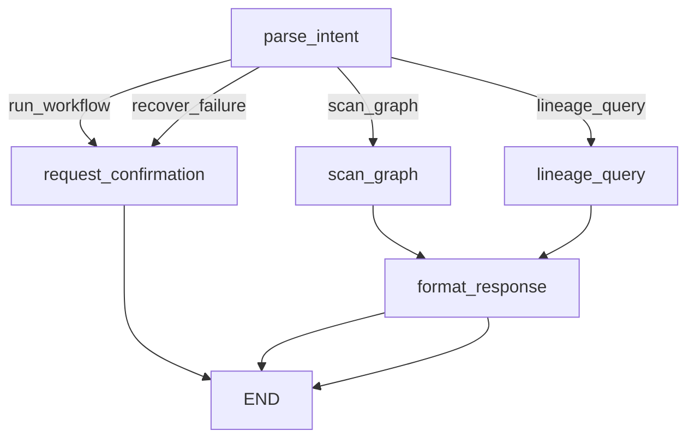

# DolphinScheduler Agent 项目宣讲文稿（完整版）

---

## 第一部分：项目背景与目标

### 1.1 为什么需要 Agent？

**痛点分析**：

| 场景 | 现状问题 | 解决目标 |
|------|----------|----------|
| 任务失败处理 | 运维人工查看日志 → 分析原因 → 手动执行修复命令 | 自动接收告警 → 智能分析 → 低风险自动修复，高风险发起审批 |
| 工作流操作 | 登录 Web UI → 找项目 → 找工作流 → 配置参数 → 点击按钮 | 钉钉对话 "@机器人 运行 a项目的工作流 xxx" |
| 血缘查询 | 翻阅代码文档，人工梳理依赖关系 | 对话提问 → 自动扫描 → 可视化展示依赖链路 |
| 参数补数 | 登录 UI → 配置日期范围 → 选择 worker 组 → 执行 | 对话 "补数 2026-01-01 到 2026-01-10"（**待实现**） |

### 1.2 项目定位

**DolphinScheduler Agent** = 智能运维助手

- **告警自动化**: 接收 DolphinScheduler 失败告警，自动分析并修复
- **对话式运维**: 通过钉钉对话执行运维操作
- **工作流血缘可视化**: 扫描工作流依赖关系，生成可视化图表

---

## 第二部分：整体架构

### 2.1 架构全景图

```
                              用户交互层
┌─────────────────────────────────────────────────────────────────┐
│                                                                 │
│   钉钉群聊 ──────────┐                          ┌── 告警推送 ───┤
│   "@机器人 运行xxx" │                          │ DolphinScheduler│
│                      ▼                          ▼      (失败时)  │
│              ┌──────────────┐           ┌──────────────┐        │
│              │DingTalkStream│           │  Webhook API │        │
│              │   Client     │           │  /alert 端点 │        │
│              │  (Stream模式) │           │ (HTTP服务)   │        │
│              └──────────────┘           └──────────────┘        │
│                      │                          │               │
└──────────────────────┼──────────────────────────┼───────────────┘
                       │                          │
                       ▼                          ▼
┌─────────────────────────────────────────────────────────────────┐
│                         Agent 决策层                            │
│                                                                 │
│   ┌──────────────┐              ┌──────────────┐               │
│   │ ChatAgent    │              │ AlertAgent   │               │
│   │ (对话处理)    │              │ (告警处理)    │               │
│   └──────────────┘              └──────────────┘               │
│          │                              │                       │
│          ▼                              ▼                       │
│   ┌──────────────────────────────────────────────────┐         │
│   │              LangGraph 状态机引擎                  │         │
│   │                                                  │         │
│   │  ┌─────────┐    ┌─────────┐    ┌─────────┐      │         │
│   │  │parse    │───▶│ route   │───▶│execute  │      │         │
│   │  │intent   │    │(条件分支)│    │nodes    │      │         │
│   │  └─────────┘    └─────────┘    └─────────┘      │         │
│   │                                      │          │         │
│   │                                      ▼          │         │
│   │                              ┌─────────────┐    │         │
│   │                              │format       │    │         │
│   │                              │response     │    │         │
│   │                              └─────────────┘    │         │
│   └──────────────────────────────────────────────────┘         │
│                                                                 │
└──────────────────────────────┼──────────────────────────────────┘
                               │
                               ▼
┌─────────────────────────────────────────────────────────────────┐
│                         核心能力层                              │
│                                                                 │
│   ┌──────────────┐  ┌──────────────┐  ┌──────────────┐         │
│   │ Skills 模块  │  │ Graph 模块   │  │ Security 模块│         │
│   │              │  │              │  │              │         │
│   │ SparkSkill   │  │ GraphScanner │  │ CommandGuard │         │
│   │ DataXSkill   │  │ GraphQuerier │  │ AuditLogger  │         │
│   │ ShellSkill   │  │ SQLParser    │  │ ApprovalWF   │         │
│   │ PythonSkill  │  │              │  │              │         │
│   └──────────────┘  └──────────────┘  └──────────────┘         │
│          │                 │                 │                 │
└──────────┼─────────────────┼─────────────────┼─────────────────┘
           │                 │                 │
           ▼                 ▼                 ▼
┌─────────────────────────────────────────────────────────────────┐
│                         集成适配层                              │
│                                                                 │
│   ┌──────────────────────────────────────────────────────┐     │
│   │                  DSCLIClient                          │     │
│   │          (dsctl CLI 封装，统一调用入口)                │     │
│   │                                                      │     │
│   │  workflow run / recover / log / list / describe     │     │
│   └──────────────────────────────────────────────────────┘     │
│                              │                                 │
│                              ▼                                 │
│   ┌──────────────┐  ┌──────────────┐  ┌──────────────┐         │
│   │DolphinScheduler│ │Spark History │ │   OSS API    │         │
│   │    API        │ │   Server     │ │              │         │
│   └──────────────┘  └──────────────┘  └──────────────┘         │
│                                                                 │
└─────────────────────────────────────────────────────────────────┘
```

### 2.2 三大核心服务详解

**入口文件**: `src/__main__.py`

```python
def main():
    mode = sys.argv[1] if sys.argv[1:] else "all"
    
    if mode == "all":
        run_all_services()      # Stream + API 同时启动
    elif mode == "stream":
        run_dingtalk_stream()   # 仅钉钉对话功能
    elif mode == "api":
        run_api_server()        # 仅告警分析服务
    elif mode == "chat":
        run_chat_repl()         # 本地交互测试
```

**Stream vs API 区别**：

| 模式 | 功能 | 触发方式 | 需要公网 |
|------|------|----------|----------|
| **stream** | 钉钉对话 | Stream 主动拉取消息 | ❌ 不需要 |
| **api** | 告警分析 | DolphinScheduler 推送告警 | ✅ 需要（或用 ngrok） |

**为什么 API 不用 Stream**：
1. 告警是 **被动接收**：DolphinScheduler 检测到失败 → 推送到 Webhook URL
2. 对话是 **主动拉取**：钉钉 Stream 服务持续推送消息
3. 两者触发机制完全不同，API 需要暴露 HTTP 端点接收 POST 请求

---

## 第三部分：核心模块详解

---

### 3.1 Integrations 模块 - 外部系统集成

**目录**: `src/integrations/`

#### 3.1.1 DSCLIClient - DolphinScheduler 操作封装

**文件**: `src/integrations/dsctl_wrapper.py`

**设计决策**: 为什么封装 CLI 而不是直接调用 API？

| 方案 | 优点 | 缺点 |
|------|------|------|
| **直接 API** | 灵活、响应快 | 需处理认证、版本兼容、参数组装、错误解析 |
| **CLI 封装** | 简单稳定、已封装好 | subprocess 调用略慢 |

**选择 CLI 的原因**:
1. `dsctl` 已处理 DolphinScheduler 3.x 的复杂认证（Token 获取、刷新）
2. 命令参数标准化，避免手写 JSON 请求体
3. CLI 自带错误提示，便于调试

**核心方法一览**：

| 方法 | 功能 | 代码位置 | 问题 |
|------|------|----------|------|
| `workflow_run()` | 运行工作流 | 第480行 | ⚠️ 缺少 worker_group/tenant 参数 |
| `workflow_instance_recover_failed()` | 恢复失败实例 | 第291行 | ✅ 正常 |
| `get_task_logs()` | 获取任务日志 | 第178行 | ✅ 正常 |
| `workflow_instance_export()` | 导出实例 YAML | 第306行 | ✅ 正常 |
| `workflow_instance_edit_patch()` | 编辑实例 | 第326行 | ✅ 正常 |

**⚠️ 需要改进**：`workflow_run` 缺少必要参数

当前实现（第480-486行）：
```python
def workflow_run(self, project_code: int, workflow_code: int) -> CLIResult:
    return self._run_command([
        "workflow", "run", str(workflow_code), "--project", str(project_code)
    ])
```

**必须参数**（参考 ad_monitor 总流程）：
- **worker_group**: `all_worker`（必须指定）
- **tenant**: 项目账户（必须指定）

改进方案：
```python
def workflow_run(self, project_code: int, workflow_code: int, 
                 worker_group: str = "all_worker",
                 tenant_code: str = None) -> CLIResult:
    args = ["workflow", "run", str(workflow_code), "--project", str(project_code)]
    args.extend(["--worker-group", worker_group])
    if tenant_code:
        args.extend(["--tenant", tenant_code])
    return self._run_command(args)
```

---

#### 3.1.2 DingTalkStreamClient - 钉钉对话集成

**文件**: `src/integrations/dingtalk_stream.py`

**Stream 模式原理**：
```
钉钉服务器 ─────────────▶ Agent (Stream Client)
              (主动推送消息)
              
Agent ─────────────▶ 钉钉服务器
        (回复消息)
```

**优势**：
- 无需公网地址和防火墙配置
- 支持多机器人实例
- 更稳定可靠

---

#### 3.1.3 ProjectResolver - 项目名解析

**文件**: `src/integrations/project_resolver.py`

**解析逻辑**（第40-119行）：

```python
def resolve_by_name(self, project_name: str) -> ProjectInfo:
    # 1. 检查缓存
    if project_name in self._cache:
        return self._cache[project_name]
    
    # 2. 尝试 project get 命令（直接查询）
    result = self.client.get_project(project_name)
    if result.success:
        # 解析返回的 project code
        return ProjectInfo(code=..., name=...)
    
    # 3. 从项目列表模糊匹配
    result = self.client.list_projects(page_size=200)
    for proj in projects:
        if proj.name == project_name or proj.name.lower() == project_name.lower():
            return ProjectInfo(code=proj.code, name=proj.name)
    
    return None
```

**是否需要人工维护对应关系**：
- **不需要**，通过 API 实时查询
- 支持精确匹配和忽略大小写匹配
- **不支持别名**：用户说"a项目"必须准确匹配"ad_monitor"

---

### 3.2 Skills 模块 - 错误分析专家系统

**目录**: `src/skills/`

#### 3.2.1 设计理念

**Skill = 快速预判器**

核心思想: 先用规则快速匹配已知错误，只有未知错误才调用 LLM

**分类体系**：

| Category | 含义 | 处理方式 | 示例 |
|----------|------|----------|------|
| **AUTO_FIXABLE** | 已知可自动修复 | 直接返回修复方案 | 分区缺失 → 检查OSS路径 |
| **RESOURCE_SUGGESTED** | 资源问题 | 智能计算配置 + LLM验证 | OOM → 增加executorMemory |
| **KNOWN_NEEDS_LLM** | 已知类型需推理 | 给 LLM 提上下文提示 | ClassNotFound → 提供类路径 |
| **UNKNOWN** | 未知错误 | 完全交给 LLM，记录候选 | 新错误类型 |

---

#### 3.2.2 BaseSkill 基类详解

**文件**: `src/skills/base.py`

**主要作用**：

```python
class BaseSkill(ABC):
    skill_name: str           # 如 "spark"
    task_types: list[str]     # 如 ["SPARK", "SPARK_STREAMING"]
    
    # === 核心方法 ===
    @abstractmethod
    def analyze(self, log_content, context) -> ErrorAnalysis:
        """分析日志，返回四类结果"""
        pass
    
    # === 增强能力 ===
    def check_oss_path(self, oss_path):
        """验证 OSS 文件是否存在"""
        validator = self.get_oss_validator()
        return validator.check_exists(oss_path)
    
    def analyze_with_llm_fallback(self, log_content, initial_analysis, context):
        """UNKNOWN 时调用 LLM 深度分析"""
        llm_result = self.get_llm_client().analyze(log_excerpt)
        # 记录候选（供人工审核后加入 patterns.md）
        self.get_candidate_store().add(candidate)
        return enhanced_analysis
    
    def build_auto_fix_action(self, analysis):
        """构建自动修复动作（仅 AUTO_FIXABLE）"""
        if analysis.category == AUTO_FIXABLE:
            return AutoFixAction(action_type="modify_script", script_changes=...)
```

---

#### 3.2.3 各 Skill 的分析逻辑

**SparkSkill** (`src/skills/spark/analyzer.py`):

| patterns.md 内容 | 分析依据 | 生成建议 |
|------------------|----------|----------|
| `java.lang.OutOfMemoryError: Java heap space` | 正则匹配错误堆栈 | 增加 executorMemory（智能计算） |
| `Partition .* does not exist` | 匹配错误输出 | 检查 OSS 分区路径 → 验证文件存在 |
| `ClassNotFoundException: xxx` | 匹配类名 | 检查类路径/依赖 |
| `Shuffle failed` | 匹配 Shuffle 错误 | 增加 shuffle partition |

**DataXSkill** (`src/skills/datax/analyzer.py`):

| patterns.md 内容 | 分析依据 | 生成建议 |
|------------------|----------|----------|
| `connection timeout` | 解析 JSON 配置 | 检查数据库连接 |
| `column mapping error` | 字段映射检查 | 修正字段配置 |
| `channel error` | 通道错误分析 | 检查通道配置 |

**ShellSkill** (`src/skills/shell/analyzer.py`):

| patterns.md 内容 | 分析依据 | 生成建议 |
|------------------|----------|----------|
| `command not found: xxx` | 匹配错误输出 | 修正命令路径 |
| `Permission denied` | 权限错误 | 调整文件权限 |
| `exit code: 127` | 退出码非0 | 分析具体命令 |

---

#### 3.2.4 Skills 是否满足生产环境

**现状评估**：

| 方面 | 满足程度 | 问题 |
|------|----------|------|
| **错误覆盖** | ⚠️ 部分 | patterns.md 需要持续补充生产错误 |
| **OSS验证** | ✅ 支持 | 可验证分区文件存在 |
| **LLM Fallback** | ✅ 支持 | 未知错误可调用 LLM |
| **候选记录** | ✅ 支持 | 新错误可记录供审核 |
| **资源配置计算** | ⚠️ 简单 | OOM 建议需要更智能的算法 |

---

### 3.3 Graph 模块 - 工作流血缘管理

**目录**: `src/graph/`

#### 3.3.1 GraphScanner - 血缘扫描器详解

**文件**: `src/graph/scanner.py`

**完整扫描流程**（第47-96行）：

```python
def scan_project(self, project_code, project_name, ds_api_url, ds_api_token):
    # 1. 创建 DSCLI 客户端
    dsctl = DSCLIClient(api_url=ds_api_url, api_token=ds_api_token)
    
    # 2. 获取所有工作流定义
    workflows = self._fetch_workflows(dsctl, project_code)
    # 调用: dsctl list_workflows --project {project_code}
    
    # 3. 解析每个工作流
    for workflow in workflows:
        self._parse_workflow(workflow, dsctl, graph, all_tables)
    
    # 4. 保存血缘数据 JSON
    self.storage.save_graph(project_code, graph.to_dict())
```

**_parse_workflow 详细流程**（第161-248行）：

```python
def _parse_workflow(self, workflow, dsctl, graph, all_tables):
    workflow_code = workflow["code"]
    
    # 1. 获取工作流详细信息
    detail_result = dsctl.describe_workflow(project_code, workflow_code)
    # 返回: {workflow: {...}, tasks: [...], relations: [...]}
    
    # 2. 创建 WorkflowNode
    workflow_node = WorkflowNode(
        code=workflow_code,
        name=workflow_data["name"],
        schedule_type="CRON" if schedule_cron else "MANUAL",
        schedule_cron=schedule_cron,
        is_sub_workflow=False
    )
    graph.nodes.workflows.append(workflow_node)
    
    # 3. 解析任务定义
    for task in tasks_data:
        task_node = TaskNode(
            code=task["code"],
            name=task["name"],
            task_type=task["type"],  # SPARK, DATAX, SHELL, etc.
            workflow_code=workflow_code,
            spark_main_class=task.get("taskParams", {}).get("mainClass")
        )
        graph.nodes.tasks.append(task_node)
        
        # 4. 添加任务所属关系
        graph.edges.workflow_contains_task.append({source: workflow_code, target: task_code})
        
        # 5. 解析任务依赖
        for dep in task.get("dependence", []):
            graph.edges.task_depends_task.append({source: task_code, target: dep["code"]})
        
        # 6. 解析 SQL 提取表
        if task["type"] == "SPARK":
            sql = task.get("taskParams", {}).get("rawScript", "")
            tables = self.sql_parser.extract_tables(sql)
            for table in tables["input"]:
                graph.edges.task_consumes_table.append({source: task_code, target: table})
            for table in tables["output"]:
                graph.edges.task_produces_table.append({source: task_code, target: table})
```

**SQL 解析逻辑** (`src/graph/sql_parser.py` 第35-60行)：

```python
def extract_tables(self, sql: str) -> Dict:
    result = {"input": [], "output": []}
    
    # 正则提取输出表
    insert_match = re.search(r'INSERT\s+(?:INTO|OVERWRITE)\s+TABLE\s+(\S+)', sql)
    if insert_match:
        result["output"].append(insert_match.group(1))
    
    # 正则提取输入表
    from_match = re.search(r'FROM\s+(\S+)', sql)
    join_match = re.search(r'JOIN\s+(\S+)', sql)
    if from_match:
        result["input"].append(from_match.group(1))
    if join_match:
        result["input"].append(join_match.group(1))
    
    return result
```

**Spark 类关联**：从任务参数 `mainClass` 字段提取，关联到代码仓库。

---

#### 3.3.2 GraphQuerier - 血缘查询器

**文件**: `src/graph/querier.py`

**查询能力**：

| 方法 | 功能 | 使用场景 |
|------|------|----------|
| `query_workflow_downstream()` | 工作流下游依赖链 | 告警影响分析 |
| `query_workflow_upstream()` | 工作流上游来源链 | 问题定位 |
| `query_table_consumers()` | 表被谁消费 | 血缘对话查询 |
| `query_table_producers()` | 表由谁产出 | 血缘对话查询 |
| `query_subworkflow_impact()` | 子流程影响分析 | 告警影响分析 |

---

### 3.4 Chat 模块 - 对话交互

**目录**: `src/chat/`

#### 3.4.1 LangGraph 状态机详解

**什么是 LangGraph**：
- 一个 **状态机编排框架**，用于定义复杂的流程
- 支持条件分支、并行执行、状态持久化
- 可以导出流程可视化图（Mermaid）

**流程可视化体现**：

```python
# 导出 Mermaid 图
graph = create_chat_graph()
mermaid_code = graph.get_graph().draw_mermaid()
print(mermaid_code)
```

生成的可视化流程：


**核心重构 (2026-05-13)**:

1. **移除关键词匹配**: 改用纯 LLM 解析意图，更智能理解自然语言表达
2. **用户确认流程**: 危险操作（run_workflow, recover_failure）需要用户确认后才执行

```
钉钉消息 → dingtalk_stream.py
          ↓
      ChatGraph.invoke(state)
          ↓
      parse_intent_node（纯 LLM 解析）
          ↓
      route_intent()
          ↓
      ┌─────────────────────────────────────┐
      │ 危险操作（run_workflow/recover_failure）│
      │   → request_confirmation_node       │
      │   → 发送确认请求到钉钉               │
      │   → END（等待用户回复）              │
      │   用户回复"确认" → check_confirmation │
      │   → execute_node → format_response  │
      └─────────────────────────────────────┘
      
      查询操作 → 直接执行 → format_response → END
```

---

#### 3.4.2 意图解析（纯 LLM）

**文件**: `src/chat/nodes/parse_intent.py`

**重构改动**: 移除 `IntentParser` 关键词匹配，直接使用 LLM 解析

**支持的意图**：

| 意图 | 生产场景 | 是否需要确认 | 实现状态 |
|------|----------|-------------|----------|
| `scan_graph` | 扫描项目血缘 | ❌ 不需要 | ✅ 已实现 |
| `lineage_query` | 血缘查询（下游/上游） | ❌ 不需要 | ✅ 已实现 |
| `visualize_lineage` | 可视化展示 | ❌ 不需要 | ✅ 已实现 |
| `query_workflow` | 查询工作流列表 | ❌ 不需要 | ✅ 已实现 |
| `query_workflow_instances` | 查询实例记录 | ❌ 不需要 | ✅ 已实现 |
| `query_status` | 查询状态 | ❌ 不需要 | ✅ 已实现 |
| `query_logs` | 查看日志 | ❌ 不需要 | ✅ 已实现 |
| `recover_failure` | 恢复失败 | ✅ 需要 | ✅ 已实现 |
| `run_workflow` | 运行工作流 | ✅ 需要 | ✅ 已实现 |
| `backfill` | 补数操作 | ✅ 需要 | ❌ 未实现 |
| `edit_workflow` | 工作流编辑 | ✅ 需要 | ❌ 未实现 |

**LLM Prompt 设计**：

```
分析用户消息，理解用户意图，返回 JSON。

支持的意图类型：
1. run_workflow - 执行/运行工作流（关键词: 执行、运行、启动）
2. query_workflow - 查询工作流列表（关键词: 工作流列表、有哪些工作流）
3. query_workflow_instances - 查工作流实例（关键词: 实例、执行了、运行记录）
...

返回 JSON:
{
  "intent_type": "意图类型",
  "workflow_code": "工作流编码（数字）",
  "workflow_name": "工作流名称",
  "project_name": "项目名称",
  "params": {"worker_group": "all_worker", "tenant": "项目名称"},
  "confidence": 0.0-1.0
}
```

**默认参数规则**：

| 参数 | 默认值 | 说明 |
|------|--------|------|
| worker_group | all_worker | 默认 Worker 组 |
| tenant | project_name | 默认租户为项目名称 |

---

#### 3.4.3 用户确认流程

**新增节点**：

| 文件 | 功能 |
|------|------|
| `nodes/request_confirmation.py` | 发送钉钉确认请求 |
| `nodes/check_confirmation.py` | 检查确认状态 |

**request_confirmation_node**：

```python
def request_confirmation_node(state: ChatState) -> ChatState:
    """请求用户确认节点"""
    # 构建确认消息
    confirmation_msg = f"""## ⚠️ 操作确认
    
**操作类型**: 运行工作流
**工作流**: {workflow_name}
**项目**: {project_name}
**Worker组**: {worker_group}
**租户**: {tenant}

回复 "确认" 执行，回复 "取消" 拒绝"""
    
    # 发送钉钉确认消息
    dingtalk.send_notification(title="操作确认", content=confirmation_msg)
    
    return {...state, "pending_confirmation": True, "confirmation_status": "pending"}
```

**dingtalk_stream.py 处理确认回复**：

```python
# 检查是否是确认/取消回复
if content.strip() in ["确认", "✅", "同意", "执行"]:
    # 查找用户的待确认请求
    pending_state = get_pending_confirmation_by_user(user_id)
    update_confirmation_status(confirmation_id, "confirmed")
    # 重新执行流程
    result_state = self.chat_graph.invoke(pending_state)

elif content.strip() in ["取消", "❌", "拒绝"]:
    update_confirmation_status(confirmation_id, "rejected")
    self.reply_markdown("操作取消", "❌ 操作已取消")
```

---

#### 3.4.4 ChatState 状态定义详解

**文件**: `src/chat/state.py`

```python
class ChatState(TypedDict, total=False):
    # ===== 输入阶段 =====
    message: str           # 用户原始消息："工作流 xxx 的下游"
    user_id: str           # 用户ID："user_001"
    conversation_id: str   # 会话ID："conv_123"
    
    # ===== 意图解析阶段 =====
    intent_type: str       # 意图类型："lineage_query"
    query_type: str        # 查询类型："downstream" / "upstream" / "table_consumer"
    
    # ===== 参数提取阶段 =====
    workflow_code: str     # 工作流编码："12656144748992"
    workflow_name: str     # 工作流名称："实时数据同步"
    project_code: str      # 项目编码："11850599683520"
    project_name: str      # 项目名称："ad_monitor"
    table_name: str        # 表名："hive.db.table"
    query_date: str        # 查询日期："2026-05-13"
    confirmation_params: dict  # 解析出的参数（供确认流程使用）
    
    # ===== 确认阶段（新增） =====
    pending_confirmation: bool     # 是否等待确认
    confirmation_message: str      # 确认消息内容
    confirmed_action: str          # 待确认操作类型
    confirmation_status: str       # "pending" / "confirmed" / "rejected"
    confirmation_id: str           # 确认请求 ID
    execute_approved: bool         # 执行已批准
    
    # ===== 查询执行阶段 =====
    result_data: dict      # 查询结果：{workflow_nodes: [...], downstream_list: [...]}
    
    # ===== 响应阶段 =====
    response_content: str  # 格式化回复："工作流 xxx 的下游依赖：..."
    error_message: str     # 错误信息："未找到工作流 xxx"
```

---

### 3.5 Security 模块 - 安全防护

**目录**: `src/security/`

#### 3.5.1 CommandGuard - 命令拦截器

**文件**: `src/security/guard.py`

**拦截规则**：

| 级别 | 命令 | 处理 |
|------|------|------|
| **CRITICAL** | delete, remove, drop, truncate | 直接拦截 |
| **HIGH** | recover | 记录日志 + 发送告警 |
| **MEDIUM** | edit, modify | 记录日志 |
| **LOW** | list, get, describe | 仅记录 |

---

#### 3.5.2 命令执行流程顺序

**正确顺序** (`dsctl_wrapper.py` 第84-158行)：

```
1. 安全检查
   ↓ (blocked=True → 返回错误)
2. 执行命令
   ↓
3. 记录审计日志
   ↓
4. 高风险操作发送告警（如果 risk_level == "HIGH"）
```

**这个顺序是正确的**：
- 安全检查必须在执行前
- 审计记录执行结果（成功/失败）
- 高风险告警在执行后发送（告知执行结果）

---

#### 3.5.3 ApprovalWorkflow - 审批流程

**文件**: `src/security/approval.py`

**审批超时设置**（第89行）：

```python
expires_minutes = settings.APPROVAL_TIMEOUT_MINUTES  # 从配置读取
expires_at = datetime.now() + timedelta(minutes=expires_minutes)
```

**完整流程**：
```
高风险操作 → create_request() → 发送钉钉审批卡片
                  │
                  ▼
           等待审批（pending）
                  │
        ┌─────────┼─────────┬─────────┐
        │         │         │         │
        ▼         ▼         ▼         ▼
    approved  rejected   timeout   超时检查
        │         │         │
        ▼         ▼         ▼
    执行操作  通知拒绝  通知超时
```

---

### 3.6 Agent 模块 - 智能决策

**目录**: `src/agent/`

#### 3.6.1 AlertAgent - 告警处理 Agent

**文件**: `src/agent/alert_agent.py`

**是否符合 Agent 定义**：

| Agent 特性 | AlertAgent 实现 | 评估 |
|------------|-----------------|------|
| 自主决策 | LangGraph 状态机规划流程 | ✅ 符合 |
| 工具调用 | DSCLIClient / Skills | ✅ 符合 |
| 记忆状态 | AgentState 状态传递 | ✅ 符合 |
| LLM 决策 | 仅 UNKNOWN 时调用 LLM | ⚠️ 部分符合 |

---

#### 3.6.2 告警处理流程（LangGraph）

**文件**: `src/workflow/graph.py`

**完整流程**：

```
1. parse_alert        - 解析告警信息
2. validate_project   - 验证项目配置
3. fetch_logs         - 获取任务日志
4. analyze_error      - Skill 分析 + LLM 深度分析
5. query_knowledge    - 搜索知识库
6. impact_analysis    - 血缘影响分析（使用 GraphQuerier）
7. assess_risk        - 风险评估
8. [分支] request_approval / execute_action
9. notify_dingtalk    - 发送结果通知
10. store_results     - 存储处理记录
```

---

#### 3.6.3 impact_analysis - 告警中是否使用血缘

**文件**: `src/workflow/nodes/risk.py`

**代码实现**：

```python
from ...tools.graph_impact import GraphImpactTool
from ...tools.impact import ImpactTool

def impact_analysis(state: AgentState):
    # If graph exists, use full impact analysis
    if graph_exists:
        querier = GraphQuerier(storage)
        sub_impact = querier.query_subworkflow_impact(
            project_code=project_code,
            workflow_code=workflow_code
        )
        
        if sub_impact["found"]:
            # Build full impact summary
            impact_summary = _build_subworkflow_impact_summary(sub_impact)
            return {
                "downstream_tasks": sub_impact["total_impact_count"],
                "impact_summary": impact_summary
            }
```

**答案：是的**，告警分析在 `impact_analysis` 阶段使用血缘关系：
1. 查询失败工作流的下游影响
2. 分析子流程的影响范围
3. 生成影响报告供风险评估

---

### 3.7 告警分析后的操作详解

**文件**: `src/workflow/nodes/execute.py`

#### 3.7.1 如何修改工作流

**modify_script 流程**（第244-302行）：

```python
def _execute_single_action(action_type="modify_script", ...):
    script_changes = {"错误命令": "正确命令"}  # 从 Skill 建议
    
    # 1. 导出工作流实例 YAML
    export_result = dsctl.workflow_instance_export(process_instance_id)
    
    # 2. 解析 YAML，找到任务定义
    data = yaml.safe_load(export_result.stdout)
    for task in data['tasks']:
        if task['name'] == task_name:
            original_script = task['task_params']['rawScript']
            
            # 3. 应用修改
            modified_script = original_script.replace(wrong_cmd, correct_cmd)
            
            # 4. 修改实例 + 同步到定义
            edit_result = dsctl.workflow_instance_edit_task_script(
                process_instance_id,
                task_name,
                modified_script,
                sync_definition=True  # 同步修改工作流定义
            )
            
            # 5. 恢复失败任务
            recover_result = dsctl.workflow_instance_recover_failed(process_instance_id)
```

---

#### 3.7.2 如何恢复任务

**recover-failed 流程**（第239-242行）：

```python
def _execute_single_action(action_type="recover-failed", ...):
    # 直接恢复失败实例
    # recover-failed 只执行失败任务，不重跑成功任务
    # 保留执行参数：worker_group, tenant 等
    return dsctl.workflow_instance_recover_failed(process_instance_id)
```

---

### 3.8 反馈按钮问题分析

**文件**: `src/tools/dingtalk_progress.py` 第147-156行：

```python
text += "💡 **知识库反馈**\n\n"
text += f"[确认有效](http://localhost:8080/feedback?entry_id={knowledge_entry_id}&feedback=valid)\n\n"
text += f"[标记无效](http://localhost:8080/feedback?entry_id={knowledge_entry_id}&feedback=invalid)\n\n"
```

**问题原因**：

| 问题 | 说明 |
|------|------|
| **地址错误** | 使用 `localhost:8080`，实际端口是 `settings.API_PORT` |
| **无法访问** | 钉钉 ActionCard 按钮需要公网地址，localhost 无法访问 |
| **ID为空** | knowledge_entry_id 只有修复成功才生成 |

**解决方案**：
1. 改用 `settings.API_HOST:settings.API_PORT`
2. 配置 ngrok 提供公网地址
3. 确保 knowledge_entry_id 存在

---

### 3.9 Token 消耗统计（新增）

**设计目标**: 追踪每次告警/对话的 LLM Token 消耗，便于成本核算。

**实现位置**:

| 文件 | 改动 | 说明 |
|------|------|------|
| `workflow/state.py` | 新增 `token_consumption`, `token_details` 字段 | 状态追踪 |
| `chat/state.py` | 新增 `token_consumption`, `token_details` 字段 | 状态追踪 |
| `tools/llm_client.py` | 新增 `MODEL_TOKEN_RULES` 字典 | 模型 tokenizer 规则配置 |
| `tools/llm_client.py` | 新增 `count_tokens(text, model)` 函数 | **根据模型选择 tokenizer** |

**模型 tokenizer 规则配置**:

```python
MODEL_TOKEN_RULES = {
    # OpenAI GPT 系列：使用 tiktoken
    "gpt-4": {"type": "tiktoken", "encoding": "cl100k_base"},
    "gpt-4o": {"type": "tiktoken", "encoding": "o200k_base"},
    
    # Claude 系列：估算
    "claude-sonnet-4-6": {"type": "estimate", "chinese_ratio": 1.5, "english_ratio": 4},
    
    # GLM 系列：估算（中文更优）
    "glm-4": {"type": "estimate", "chinese_ratio": 1.2, "english_ratio": 4},
    "glm-5": {"type": "estimate", "chinese_ratio": 1.2, "english_ratio": 4},
}
```

**Token 获取策略**:

```python
# 1. 根据模型选择 tokenizer 规则
rule = MODEL_TOKEN_RULES.get(model, MODEL_TOKEN_RULES["default"])

# 2. 优先使用 tiktoken（如果模型支持且已安装）
if rule["type"] == "tiktoken":
    import tiktoken
    enc = tiktoken.get_encoding(rule["encoding"])
    return len(enc.encode(text))

# 3. 备用：估算（GLM-5 中文约 1.2 字符/token）
else:
    return estimate_tokens(text, rule["chinese_ratio"], rule["english_ratio"])
```

**为什么根据模型计算？**

不同模型的 tokenizer 不同：
- GPT 系列：使用 tiktoken 库精确计算
- GLM 系列：中文优化，token 比例约 1.2 chars/token
- Claude 系列：未公开 tokenizer，估算备用

**Token 消耗范围**:

| 场景 | LLM 调用 | Token 消耗 |
|------|----------|------------|
| 告警 - AUTO_FIXABLE | 无 | 0 tokens |
| 告警 - RESOURCE_SUGGESTED | 1 次 | ~1500-2000 |
| 告警 - UNKNOWN | 2 次 | ~3000 |
| 对话 - 明确关键词 | 无 | 0 tokens |
| 对话 - 模糊表达 | 1 次 | ~400-900 |

**通知展示**:

钉钉通知底部显示：
```
### Token 消耗
- **总计:** 1800 tokens
- **analyze_resource:** input=1200, output=600
```

---

### 3.10 真实资源数据获取（新增）

**文件**: `src/skills/spark/scripts/resource_metrics.py`

**设计目标**: 从 YARN ResourceManager 和 Spark History Server 获取真实资源使用数据，而非仅依赖日志正则提取。

**数据来源**:

| 数据源 | API | 获取内容 |
|--------|-----|----------|
| YARN ResourceManager | `/ws/v1/cluster/apps/{app_id}` | 容器资源、诊断信息、运行时长 |
| Spark History Server | `/api/v1/applications/{app_id}` | Executor metrics、Shuffle 数据量、内存溢出 |

**认证方式**:

```python
# YARN 通过 Knox Gateway（LDAP 认证）
auth = HTTPBasicAuth(settings.YARN_USERNAME, settings.YARN_PASSWORD)
response = requests.get(url, auth=auth, verify=False)
```

**环境变量配置**:

```bash
# Spark History Server
SPARK_HISTORY_URL=http://ali-odp-test-02.huan.tv:18082

# YARN ResourceManager（Knox Gateway）
YARN_RM_URL=https://ali-odp-test-01.huan.tv:8443/gateway/default/yarn
YARN_USERNAME=fengxiaoping
YARN_PASSWORD=xxx
```

**调用时机**:

在 `analyzer.py` 中按需调用：
- 资源类问题（RESOURCE_SUGGESTED）
- 日志信息不足（UNKNOWN）
- error_blocks 为空（Driver 日志信息不足）

**示例输出**:

```python
{
    "yarn_info": {
        "allocated_vcores": 4,
        "allocated_memory_mb": 8192,
        "diagnostics": "Container killed by YARN for exceeding memory"
    },
    "spark_metrics": {
        "executor_count": 2,
        "shuffle_read_mb": 59,
        "shuffle_write_mb": 103,
        "memory_spilled_mb": 0
    },
    "current_config": {
        "executor_memory": "2g",
        "executor_cores": "2"
    }
}
```

---

### 3.11 资源建议简化（新增）

**文件**: `src/skills/spark/scripts/calculate_resource.py`

**设计目标**: 简化输出，只返回 DolphinScheduler UI 支持的 5 个参数。

**DolphinScheduler 支持的参数**:

| 参数 | Spark 配置名 | 说明 |
|------|-------------|------|
| `driver_memory` | spark.driver.memory | Driver 内存 |
| `driver_cores` | spark.driver.cores | Driver 核心数 |
| `executor_memory` | spark.executor.memory | Executor 内存 |
| `executor_cores` | spark.executor.cores | Executor 核心数 |
| `executor_instances` | spark.executor.instances | Executor 数量 |

**输出格式**:

```python
{
    "config_changes": {
        "executor_memory": "4g",      # 建议值
        "executor_instances": "4"
    },
    "reasoning": "OOM + shuffle 103MB, 建议 Executor 内存翻倍",
    "source": "skill_calculated"
}
```

---

### 3.12 错误分析报告（新增）

**设计目标**: 生成完整的错误分析报告，让用户验证 Agent 分析逻辑是否正确。

**实现位置**:

| 文件 | 功能 |
|------|------|
| `tools/report_generator.py` | 生成 HTML + JSON 格式报告 |
| `api/report_api.py` | 报告查看 API 端点 |
| `workflow/state.py` | 新增 `report_id`, `report_url` 字段 |
| `workflow/nodes/store.py` | 调用 ReportGenerator 生成报告 |
| `tools/dingtalk_enterprise.py` | 钉钉通知添加报告链接 |

**报告生成流程**:

```
告警分析完成 → store_results 节点
                    ↓
          ReportGenerator().generate_report(state)
                    ↓
          生成 HTML + JSON 报告文件
                    ↓
          构建 report_url: http://{host}:{port}/report/{report_id}
                    ↓
          存入 state: report_id, report_url
                    ↓
          notify_dingtalk 发送钉钉通知（含报告链接）
```

**报告存储目录**:

```
data/reports/
└── 2026-05-13/                 # 按日期分组
    └── 12345/                   # 工作流 code
        └── report_143022_111/   # 报告 ID（时间+task_code）
            ├── report.html      # HTML 页面（用户友好）
            └── report.json      # JSON 数据（程序可解析）
```

**报告内容包含**:

| 章节 | 内容 |
|------|------|
| 基本信息 | 项目、工作流、任务、实例 ID |
| 分析流程 | 每个节点的输入/输出（parse → fetch → analyze → risk → execute） |
| 错误分析 | Skill 预判结果、LLM 分析结果、错误类型、分析过程、推理依据 |
| 资源数据 | Driver 日志配置、YARN ResourceManager 数据、Spark History Server 数据 |
| 风险评估 | 风险等级、下游任务数、风险因素、影响摘要 |
| 修复建议 | 动作类型、配置变更、脚本变更 |
| 执行结果 | 执行状态、命令输出 |
| Token 消耗 | 总消耗、各节点明细 |

**报告 API 端点**:

```powershell
# 查看报告列表
GET http://localhost:8080/report/list

# 查看报告（HTML）
GET http://localhost:8080/report/{report_id}?workflow=12345&date=2026-05-13

# 查看报告（JSON）
GET http://localhost:8080/report/{report_id}/json?workflow=12345&date=2026-05-13
```

**钉钉通知中的报告链接**:

```markdown
---

### 📋 详细分析报告
[点击查看完整分析报告](http://localhost:8080/report/report_143022_111)

报告包含完整的分析过程、Skill 预判结果、LLM 验证、
资源数据、风险评估等详细信息。
```

**报告 HTML 页面效果**:

包含样式化的报告页面，用户可以：
1. 查看完整的分析流程（每个步骤的输入/输出）
2. 验证 Skill 预判是否正确
3. 查看 LLM 分析过程和推理依据
4. 查看真实资源数据（Driver 日志配置 + YARN/Spark History）
5. 理解修复建议的依据

---

### 3.13 Driver 日志配置优先策略（新增）

**设计目标**: Spark 任务配置信息优先从 Driver 日志提取，History/YARN 仅用于深度分析补充。

**数据来源优先级**:

| 来源 | 用途 | 优先级 |
|------|------|--------|
| Driver 日志 config_lines | 配置信息主要来源（spark.driver.memory 等） | **最高** |
| Spark History Server | Executor metrics、Shuffle 数据量（深度分析） | 补充 |
| YARN ResourceManager | 容器诊断信息（错误定位） | 补充 |

**实现逻辑** (`src/skills/spark/analyzer.py`):

```python
# 1. 从 Driver 日志配置行解析 Spark 配置（主要来源）
current_config = {}
for line in config_lines:
    if "=" in line:
        key, value = line.split("=", 1)
        key = key.strip()
        value = value.strip()
        # 映射 Spark 配置名到 DolphinScheduler UI 参数名
        if key == "spark.driver.memory":
            current_config["driver_memory"] = value
        elif key == "spark.executor.memory":
            current_config["executor_memory"] = value
        ...

print(f"[SparkSkill] Driver config: {current_config}")

# 2. 按需获取补充信息（仅用于深度分析，不覆盖配置）
if need_deep_analysis and app_id:
    real_data = fetch_real_spark_metrics(app_id)
    real_metrics = real_data.get("data_metrics", {})  # 只取 metrics
    yarn_info = real_data.get("yarn_info", {})        # 只取诊断信息
```

**调用时机（按需）**:

只在以下情况调用 YARN/Spark History API：
- 资源类问题（RESOURCE_SUGGESTED）
- 日志信息不足（UNKNOWN）
- error_blocks 为空

**示例输出**:

```
[SparkSkill] Driver config: {'executor_memory': '4g', 'executor_cores': '2'}
[SparkSkill] Metrics from History: {'shuffle_read_mb': 59, 'memory_spilled_mb': 0}
```

---

## 第四部分：对话功能支持的真实场景

基于现有血缘数据（ad_monitor 项目）：

| 场景 | 支持情况 | 示例命令 |
|------|----------|----------|
| 扫描项目血缘 | ✅ 支持 | "扫描项目 ad_monitor 血缘" |
| 查询下游依赖 | ✅ 支持 | "工作流 总流程 的下游" |
| 查询上游来源 | ✅ 支持 | "工作流 xxx 的上游依赖" |
| 查询表消费者 | ✅ 支持 | "表 hive.ad_monitor.xxx 被谁消费" |
| 可视化展示 | ✅ 支持 | "展示工作流 xxx 的依赖图" |
| 运行工作流 | ⚠️ 缺参数 | "运行工作流 xxx"（缺少 worker_group/tenant） |
| 查询实例状态 | ✅ 支持 | "工作流 xxx 今天的状态" |
| 查看日志 | ✅ 支持 | "查看任务 xxx 的日志" |
| 恢复失败 | ✅ 支持 | "恢复工作流 xxx 的失败任务" |
| 补数 | ❌ 未实现 | 需要添加意图和节点 |
| 工作流编辑 | ❌ 未实现 | 需要添加意图和节点 |

---

## 第五部分：关键技术决策

### 5.1 CLI 封装 vs 直接 API

**决策**: 使用 `dsctl` CLI 而非直接调用 DolphinScheduler REST API

**原因**: CLI 已处理复杂认证、版本兼容、参数组装

**代价**: subprocess 调用略慢，但运维场景对延迟不敏感

---

### 5.2 LangGraph 状态机

**决策**: 使用 LangGraph 编排对话流程

**原因**:
- 流程可视化：可导出 Mermaid 图
- 条件分支：根据意图路由到不同处理节点
- 状态持久化：可暂停恢复长时间操作

---

### 5.3 Skill 规则优先

**决策**: 先用规则匹配（Skill），再 LLM Fallback

**原因**:
- 成本：已知错误用规则，不消耗 LLM token
- 速度：规则匹配毫秒级，LLM 调用秒级
- 准确性：已知错误规则更精准

---

### 5.4 Stream vs Webhook

**决策**: 对话用 Stream，告警用 Webhook API

**原因**:
- 对话：需要主动拉取消息，Stream 无需公网
- 告警：需要被动接收推送，API 需要暴露端点

---

## 第六部分：代码目录结构

```
src/
├── __main__.py              # 入口文件
│
├── agent/                   # Agent 决策层
│   ├── alert_agent.py       # 告警处理 Agent
│   └── chat_agent.py        # 对话 Agent
│
├── api/                     # Webhook API
│   └── webhook_api.py       # FastAPI 端点
│
├── chat/                    # 对话流程
│   ├── graph.py             # LangGraph 状态机
│   ├── state.py             # ChatState 状态定义
│   ├── nodes/               # 各节点实现
│   │   ├── parse_intent.py  # 意图解析
│   │   ├── scan_graph.py    # 扫描血缘
│   │   ├── query_lineage.py # 血缘查询
│   │   ├── run_workflow.py  # 运行工作流 ⚠️缺参数
│   │   └── format_response.py
│   └── tools/
│       └── intent_parser.py # 意图解析器
│
├── graph/                   # 工作流血缘
│   ├── scanner.py           # 血缘扫描器
│   ├── querier.py           # 血缘查询器
│   ├── storage.py           # JSON 存储
│   └── sql_parser.py        # SQL 表名解析
│
├── integrations/            # 外部集成
│   ├── dsctl_wrapper.py     # dsctl CLI 封装 ⚠️workflow_run缺参数
│   ├── dingtalk_stream.py   # 钉钉 Stream
│   └── project_resolver.py  # 项目名解析
│
├── security/                # 安全模块
│   ├── guard.py             # 命令拦截
│   ├── audit.py             # 审计日志
│   └── approval.py          # 审批流程（有超时设置）
│
├── skills/                  # 错误分析
│   ├── base.py              # Skill 基类
│   ├── spark/analyzer.py    # Spark 分析
│   ├── datax/analyzer.py    # DataX 分析
│   └── shell/analyzer.py    # Shell 分析
│
├── workflow/                # 告警工作流
│   ├── graph.py             # 告警 LangGraph
│   ├── state.py             # AgentState
│   └── nodes/
│       ├── analyze.py       # 错误分析
│       ├── execute.py       # 执行修复
│       └── risk.py          # 影响分析（使用血缘）
│
├── tools/                   # 工具类
│   ├── llm_client.py        # LLM 客户端
│   └── dingtalk_progress.py # 钉钉通知 ⚠️反馈按钮地址错误
│
└── config/                  # 配置
    ├── settings.py          # 全局配置（含 APPROVAL_TIMEOUT_MINUTES）
    └── projects.py          # 项目配置
```

---

## 第七部分：待改进事项

| 问题 | 文件 | 改进方案 |
|------|------|----------|
| workflow_run 缺参数 | dsctl_wrapper.py | 添加 worker_group/tenant 参数 |
| 反馈按钮地址错误 | dingtalk_progress.py | 使用 settings.API_PORT + ngrok |
| 补数意图未实现 | intent_parser.py | 添加 backfill 意图和节点 |
| 工作流编辑未实现 | intent_parser.py | 添加 edit_workflow 意图 |
| patterns.md 不完整 | skills/spark/patterns.md | 补充生产环境错误模式 |

---

## 第八部分：启动与使用

```bash
# 完整服务
python -m src

# 仅对话
python -m src stream

# 仅告警
python -m src api

# 本地测试
python -m src chat

# 血缘可视化
python lineage_server.py --ngrok
```

---

*文档版本: 2026-05-13 完整版（含 Driver 日志配置优先、置信度移除）*